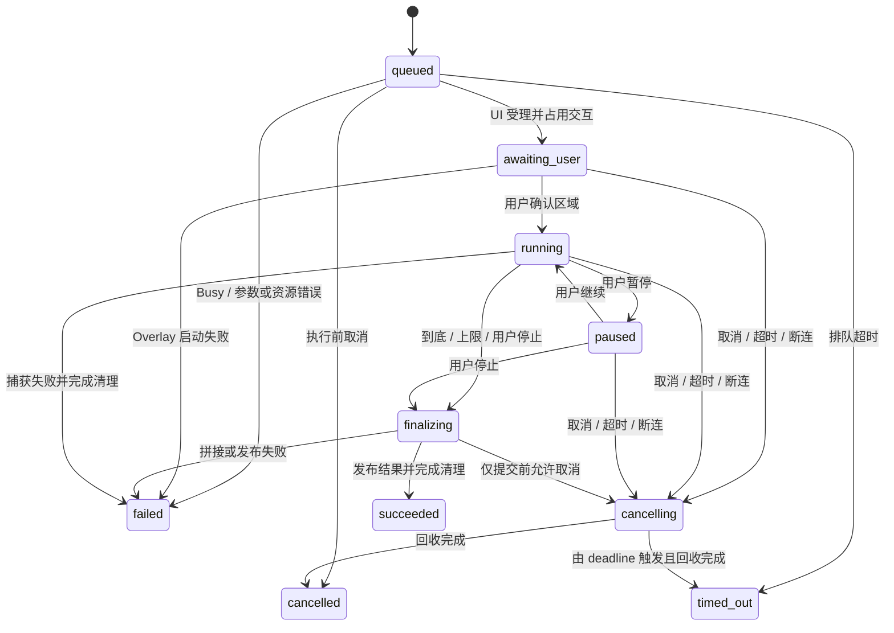

# F9 Agent / MCP：架构与实施方案

> 方案状态：F9-01～F9-08 契约、应用入口、交互占用、有界调度、固定 JSON 依赖与私有 wire codec 及自动验收完成；F9-09～F9-24 未开始，尚无新增可调用 Tool。
>
> 核验日期：2026-09-07；源码基线：`40d22e21`。
>
> 目标：复用现有截图能力，提供可连接、可取消、结果不会串用、退出可回收的本机 Agent 接口。

## 1. 推荐决策

采用 **同一个 EXE 的两种运行模式 + 本机 Named Pipe + 应用层受控入口**：

```text
MCP 客户端
    │ 标准 MCP / stdio
    ▼
qingying.exe --mcp-stdio        按客户端启动的轻量协议进程
    │ 私有、版本化 IPC / Named Pipe
    ▼
qingying.exe                   已运行的托盘主进程
    │ PipeServer → UiActionScheduler → AutomationEndpoint
    ├─ 单步动作 → ActionDispatcher → Handler → 现有能力模块
    └─ 交互长截图 → CaptureWorkflow → LongShotController
                                      → 现有 profile / engine
```

核心取舍：

1. **单步 Action 与多步 Workflow 继续分开。** MCP 协议层不直接接触 Overlay、GDI、DXGI 或 LongShot 私有实现；需要用户选区时，由应用层 Workflow 受控地使用 Overlay。
2. **协议进程不创建托盘、热键、截图引擎、插件宿主。** 连接断开只结束对应协议进程，不退出桌面应用。
3. **所有应用状态在 UI 线程协调。** Pipe I/O 与 JSON 编解码不占用 UI 线程；耗时导出在取得不可变图片租约后交给有界 worker。
4. **结果从“一个 GUI 当前图”扩展为“每个作用域一个结果 + 有限租约”。** GUI 结束仍释放自己的图；Agent 的图由自己的作用域、有效期和字节预算管理。
5. **长截图立即返回 operation_id。** 用户在原生界面确认区域，Agent 用普通 Tool 查询和取消操作。
6. **先打通纵向闭环，再扩展 Tool。** 第一条链路是协议 → 管道 → UI → status；第二条是截图 → result_id → 保存。

这会增加按需启动的协议进程，但不需要额外发布一个 bridge EXE，也不引入 Node/Python 运行时。当前 F6 已部署 `plugins/longshot` DLL，因此“最终交付严格单文件”仍是项目层面待解决的既有差异，不能由本方案宣称达标。

## 2. 基于当前源码的判断

以下是制定方案时 `40d22e21` 基线的已落地基础，可以直接复用；实施后的状态以第 12 节各任务记录为准：

- `include/qingying/action/types.hpp:112`：Action payload 已经是 `std::variant`；`:182` 已有 request/operation ID、取消令牌、超时和提交时间。**无需重新做一遍类型化 Action 重构。**
- `include/qingying/action/types.hpp:63`：已有 `ResultSelection::current/specific`。
- `src/app/result_action_service.cpp:33`：Copy / Save / Pin 已有统一结果动作服务；带 path 的 Save 不弹对话框。
- `include/qingying/app/ui_message_channel.h:14`：跨线程 payload 由 channel 持有，Windows 消息只携带 token，可复用其所有权模型。
- `src/app/application.cpp:61`：Application 已使用 PIMPL，并在组合根构造 Workflow、Controller 和结果服务。
- `src/app/longshot_controller.cpp:114`：已有 cancel / join / drain 的长截图退出收口。

必须补齐或修正的实际缺口：

- `src/mcp/mcp_bridge.cpp:33`：`start()` 仍返回 false；`:39` 的 submit 直接同步 dispatch。Application 尚未构造、启动 McpBridge。
- `src/app/action_handlers.cpp:142`：仅注册 Status / CaptureRegion / Copy / Save / Pin。`captureWindow` 与 `cropCenter` 在 `src/capture/capture_engine.cpp:201`、`:210` 仍为桩。
- `include/qingying/action/types.hpp:250`：ActionResult 没有类型化结果元数据；捕获 Handler 发布结果后没有回传 ResultId。
- `src/app/result_store.cpp:33`、`:67`：仅保存一个当前图，旧 ID 在替换后失效；`get()` 会深拷贝整张图片。
- `src/app/capture_workflow.cpp:491`：工作流结束会 clear；不能在结束后临时查 current 再给 MCP 回图。
- `src/action/action_dispatcher.cpp:135`：Handler 完成后再检查取消/超时，会把已经执行的保存、复制、钉图改报失败。
- `include/qingying/app/capture_workflow.hpp:54`：当前 beginSelection 只返回是否启动，没有外部操作完成契约。
- `src/app/longshot_controller.cpp:89`：完成 token 尚未确认有效就 join；F9 接入前应增加 operation generation 校验，防止旧消息影响新任务。

开发清单及架构文档现已同步到 `40d22e21 / 2026-09-07`；其中已落地的类型化 Action、ResultStore、中立坐标和 Chromium 插件状态按当前代码记录，本文只把 F9 尚未实现的外部契约列为待办。

当前验证基线：已有 Release 构建目录的 CTest 共 382 个用例，378 个通过、4 个 `BitBlt` 环境失败；重新执行 `build.bat Release test` 时在 MSBuild FileTracker 阶段遇到 `E_ACCESSDENIED`，F9 本身仍未接入生产代码。

阅读范围包括开发清单、README、architecture、PROGRESS、架构调整、耦合分析和 F6 新计划，以及上述源码和相关测试。IDE 提及的 `docs/lifecycle-design-principles-review.html` 在本次工作区未找到；开发清单引用的两篇金山文档未能取得正文，未据此推断额外要求。

## 3. 模块边界与依赖

### 3.1 协议侧

`McpProtocolSession` 管理已支持版本的生命周期、JSON-RPC ID、Tool 请求与响应编码。`ToolCatalog` 定义工具名、描述、input/output schema、纯参数映射和执行类别。

`McpBridge` 改为依赖中立的 `IAutomationClient`，实际实现为 `PipeAutomationClient`。删除“从任意线程直接持有 ActionDispatcher 指针”的外部通路。ToolCatalog 和 McpBridge 都不 include `Application`、`CaptureWorkflow` 或任何 GUI 类型。

每个工具的名称、schema、decoder、结果 encoder 放在同一个 descriptor 中。用一致性测试检查必填字段和拒绝规则，避免一处 schema 声明可用、另一处代码不接受。首期工具很少，普通静态注册表足够，不新增动态 MCP 插件框架。

### 3.2 应用侧

`AutomationEndpoint` 是外部能力的应用入口，负责连接作用域、能力检查、参数复核、忙碌仲裁、OperationRegistry 和结果授权；只在 UI 线程操作这些对象。

`UiActionScheduler` 负责有界入队、PostMessage token、期限、代际和完成投递，不承担截图业务。

`OperationRegistry` 只存状态、进度、时间和结果元数据，不保存图片副本。`ResultStore` 持有不可变像素；`ResultLease` 保证消费者使用期间像素仍有效。

`CaptureWorkflow` 继续处理选区、长截图 UI 和结果发布。它只理解中立的 operation ID、结果作用域和完成回调，不理解 MCP、JSON、管道或客户端产品名。

### 3.3 建议编译目标

```text
qingying_action                  现有；类型化 Action / Result
qingying_automation_contract     新 INTERFACE target；中立请求、完成契约
qingying_ipc                     新 STATIC target；Win32 Pipe + 私有 wire codec
qingying_mcp                     现有；MCP session / ToolCatalog / stdio / bridge
qingying_automation              新 STATIC target；应用入口、调度、operation
qingying_window                  按复用需要拆出；窗口发现和候选解析
qingying_workflow                现有；Workflow / Controller / ResultStore 等
qingying                        现有 EXE；模式选择与依赖组装
```

`mcp → automation_contract → action`；`ipc → automation_contract`；`automation → action + workflow`；EXE 组合这些目标。MCP 与 IPC 的 JSON 依赖设为 PRIVATE，公开头不出现 JSON 类型。稳定契约不包含 Windows.h；HANDLE/HWND 仅存在于平台实现及现有 GUI 层。

不把 ResultStore、协议、业务状态机全部塞进 McpBridge::Impl，也不为了 F9 搬迁所有现有源码。PIMPL 用于真实的平台/线程实现边界，简单值类型保持透明。

## 4. 进程模式与协议版本

### 4.1 启动模式

在 `src/app/main.cpp` 中使用 Unicode 命令行解析，在构造 Application、SingleInstanceGuard、插件宿主之前分支：

```text
无参数           → 现有托盘模式
--mcp-stdio      → 仅启动 stdio MCP server 和 Pipe client
未知参数         → 明确退出码与 stderr，协议模式不弹 MessageBox
```

WIN32 子系统 EXE 需用继承的标准句柄读写 UTF-8，检验 GetStdHandle 返回值；不创建控制台，不调用 AllocConsole。stdout 只输出完整 MCP 消息，诊断走 stderr。模式分支必须早于 GUI 单实例检查，否则客户端启动 server 会收到“程序已运行”弹窗并失败。

首期要求托盘应用已运行且已启用 Agent 接口。Bridge 可完成协议握手和 tools/list；`status` 在管道不可用时返回 `reachable:false`、`app_running:null` 和具体连接原因，不能仅凭连接失败断言托盘进程没运行。连接成功则查询真实状态。执行截图工具在连接不可用时返回明确错误，不静默拉起桌面交互。自动拉起以后作为显式配置扩展。

托盘侧服务必须在 Handler 注册、托盘 HWND 创建、owner 绑定和消息路由安装完成之后才开始接受业务请求。关闭开关只停止自动化服务；重新启用创建新 connection generation，不复用旧连接的结果 ID。

单个发布 EXE 的不同运行模式无需新增部署二进制，但**进程数量和内存必须分别测量**，不能只报托盘进程的内存。

### 4.2 冻结支持范围，避免混用版本

截至本次核验，MCP 官方 current 是 **2026-07-28**，采用按请求携带版本元数据与 server/discover；2025-11-25 及更早版本使用 initialize 握手。这是协议差异，不是修改一个版本字符串就能兼容。[官方版本说明](https://modelcontextprotocol.io/docs/2026-07-28/learn/versioning)

在目标客户端尚未指定的情况下，本方案把 **2025-11-25 / stdio 作为首个实现与验收 profile**，优先建立可测闭环。支持范围应写成确切版本，不能宣称已支持任意客户端或最新协议。若目标客户端只支持新协议，则把 2026 profile 提前为首发必要工作。

2025 profile 实现：initialize、notifications/initialized、ping、tools/list、tools/call、notifications/cancelled；只声明实际实现的 tools 能力。版本协商遵循规范；收到未知 server/discover 返回确定的 JSON-RPC 方法错误，使支持旧版回退的客户端有机会继续握手。[2025 生命周期](https://modelcontextprotocol.io/specification/2025-11-25/basic/lifecycle)

`McpProtocolSession` 隔离 profile。未来的 2026 profile 独立实现 server/discover、必需的 `_meta` 验证、对应 response/resultType 和取消规则，再复用同一 ToolCatalog 与应用层。不要把新旧字段无条件混在一份响应里。[2026 传输语义](https://modelcontextprotocol.io/specification/2026-07-28/basic/transports)

stdio 使用逐行 UTF-8 JSON-RPC，单条消息不带未转义的内部换行；stdout 不混日志。EOF 触发本连接清理。Named Pipe 是**产品内部 IPC**，不是要求通用 MCP 客户端直接识别的传输方式。[stdio 规范](https://modelcontextprotocol.io/specification/2026-07-28/basic/transports/stdio)

### 4.3 JSON 依赖

F9-08 已固定 `nlohmann_json 3.11.3`，上游头文件和 MIT 许可证随 `vendor/nlohmann_json` 入库；`cmake/JsonDependency.cmake` 在配置时校验两个文件的 SHA-256，缺失或不符明确失败，不联网下载、不回退到系统版本。来源、校验值及离线准备方式见 [依赖说明](../vendor/nlohmann_json/README.md)。IPC PRIVATE 链接 `nlohmann_json::nlohmann_json`，后续 MCP 实现复用该 PRIVATE 依赖，公开头不暴露 JSON 类型。使用 SAX 预检和统一异常边界，分配异常返回 ResourceLimit。[官方 CMake 集成](https://json.nlohmann.me/integration/cmake/)

这是为小规模控制消息选择的实现便利性，并非已经证明其体积最优。验收 Release 增量包体与编译耗时后再决定是否替换；不让 JSON 类型渗入核心以便保留替换空间。不要手写完整 JSON parser。

## 5. Tool 契约

### 5.1 核心工具

1. **`status()`**：返回 reachable、app_running、automation_enabled、busy、busy_reason、build_version、能力列表及实际限额。连接失败时无法确认的应用字段为 null，并返回连接 reason；无图片、无 UI 副作用。Bridge 的连接错误与托盘真实状态分开表达。
2. **`capture_window(query, match="contains", process_id?)`**：唯一匹配后截取窗口边界内的桌面可见像素。返回 result_id、width、height、bounds、capture_mode、expires_in_ms。0 匹配返回 WindowNotFound，多匹配返回 WindowAmbiguous 与有数量上限的候选。
3. **`crop_center(width, height)`**：明确为“对主显示器中央重新截图”，单位为物理像素；超出显示器尺寸报 InvalidArgument。以后可增加 monitor 参数。它不是裁切上一张结果；后者将来另设 crop_result。
4. **`save(result_id, path, name, overwrite=false, request_key?)`**：path 为目录，name 为一个 PNG 文件名；应用层合成完整路径，进入不弹框的保存服务。返回最终绝对路径、result_id、格式。外部 schema 不接受省略结果 ID。
5. **`copy(result_id, request_key?)`**：复制指定作用域中的结果；成功不释放结果，用户随后还可保存或 Pin。
6. **`pin(result_id, request_key?)`**：创建原生 Pin；返回 pin_id。Pin 取得自己需要的图像所有权，原租约到期不影响已创建的 Pin。
7. **`longshot_select(timeout_ms=180000)`**：受理后立即返回 operation_id 和 awaiting_user 状态；区域由用户在原生 Overlay 确认。成功后通过操作查询得到 result_id。

`save(path,name)`、`copy()`、`pin()` 是旧清单的产品级简写。F9 对外 API 刻意增加必填 result_id，避免不确定的“全局当前图”；这应作为接口定稿同步回开发清单。

### 5.1.1 用户是否会看到遮罩

MCP 调用按“静默动作”和“交互动作”分开，不能把所有截图都绑定到 `SelectionOverlay`：

| Tool | 是否显示全屏选区遮罩 | 用户可感知行为 |
|---|---|---|
| `status` / `get_operation` / `release_result` | 否 | 无桌面变化 |
| `crop_center` | 否 | 直接截主显示器中心；若有 QingYing Pin，会短暂隐藏并恢复 Pin |
| `capture_window` | 否 | 直接截窗口当前可见桌面像素，不激活、不移动窗口；可能短暂隐藏并恢复 Pin |
| `save` / `copy` | 否 | 保存不弹文件对话框；复制只改变剪贴板 |
| `pin` | 否 | 创建一个用户可见的原生钉图窗口，这是动作本身的结果 |
| `longshot_select` | 是 | 显示原生选区遮罩，由用户框选并确认长截图；取消、超时或断连会关闭遮罩 |

因此，在 Codex 中调用 `crop_center` 或唯一匹配的 `capture_window`，用户不会看到普通框选遮罩；调用 `longshot_select` 时用户必须看到遮罩并参与确认。MCP 不会模拟鼠标替用户框选，也不能在用户无感知的情况下完成这个交互流程。

直截过程仍可能有极短的 Pin 隐藏/恢复视觉变化，这是为了避免把 QingYing 自己的 Pin 截进结果。若产品要求“每一次 Agent 截图都明确可见”，在托盘增加 Agent 调用状态指示或通知即可，不需要把所有直截改成全屏遮罩；该指示不改变截图像素契约。

### 5.2 支撑生命周期的工具

- **`get_operation(operation_id)`**：返回 state、进度、失败上下文，以及终态中的结果元数据。终态状态与图片是否仍有效分开，结果过期不让操作从 succeeded 倒退成 failed。
- **`cancel_operation(operation_id)`**：同一作用域内取消操作；重复取消幂等。返回 cancellation_requested 或既有终态，不提前声称 worker 已停止。
- **`release_result(result_id)`**：显式结束本作用域结果保留；重复释放同一已释放句柄可幂等成功。不能释放其他作用域的图。

这三个是 QingYing 自定义的普通 Tool，**不等同于 MCP tasks/get 或 tasks/cancel**。首期不声明 Tasks 能力。后续若接入对应版本的标准 Tasks，只在协议侧适配同一 OperationRegistry。

`capture_region` 可作为内部集成测试路径，首发外部列表保持清单范围。`suggest_name`、图像资源读取、Base64 图片返回、OCR、任意 UI 自动化均不纳入本次核心实现。

### 5.3 请求与输出类型

保留现有 ActionPayload；扩展类型化输出和中立执行上下文。下面是建议契约草图，非当前可编译代码：

```cpp
using ResultScopeId = std::uint64_t;

struct ActionContext {
  ResultScopeId result_scope;  // 默认 GUI scope；由可信入口设置
};

struct CapturedResult {
  ResultId result_id;
  int width;
  int height;
  ScreenPhysicalRect bounds;
  CaptureMode capture_mode;
};

struct SavedResult {
  ResultId result_id;
  std::wstring absolute_path;
};

using ActionOutput = std::variant<std::monostate, StatusInfo,
                                 CapturedResult, SavedResult,
                                 CopiedResult, PinnedResult,
                                 WindowCandidates>;
// ActionResult 保留 ok/error_code/message/diagnostics，增加 output。
// ActionRequest 增加 context；MCP 无权直接指定其 result_scope。
```

scope 不是 MCP session 类型，不携带产品名、JSON 或 HANDLE。GUI 默认作用域保持原语义；F8 可复用同样的应用入口及上下文。

JSON-RPC id 原样保留其字符串/数字类型，按连接关联到内部 RequestId。OperationId 为主进程生成的业务标识。对外 result_id / operation_id 使用不透明字符串，避免 uint64 经 JavaScript 丢精度；映射绑定本次应用实例与连接作用域，不信任客户端传入的 scope。

下面是 **2025 profile** 的完成响应示例。结构化内容与文本摘要同源生成，outputSchema 验证 structuredContent；核心层不拼 JSON。[2025 Tool 结果规范](https://modelcontextprotocol.io/specification/2025-11-25/server/tools)

```json
{
  "jsonrpc": "2.0",
  "id": "capture-1",
  "result": {
    "content": [{"type": "text", "text": "截图完成：1200 × 800；结果有效期 60 秒。"}],
    "structuredContent": {
      "ok": true,
      "result_id": "r_A7N8K2",
      "width": 1200,
      "height": 800,
      "capture_mode": "visible_screen",
      "expires_in_ms": 60000
    },
    "isError": false
  }
}
```

## 6. 结果所有权与内存：先解决跨调用串图

### 6.1 对现有一图策略的有限扩展

推荐将 ResultStore 升级为 **按作用域单槽**：GUI 一个槽，每条已认证连接一个槽。新捕获在通过参数、busy、预算预检后被正式受理，立即释放本作用域旧图；该捕获失败也不恢复旧图。其他作用域不受影响。

内部图像以不可变共享所有权保存，`ResultLease` 包装 `shared_ptr<const Image>` 和元数据。`Image` 本身仍是现有 BGRA 值类型，无需把 shared_ptr 放进全部图形模块。

建议接口：

```cpp
ResultId publish(ResultScopeId scope, Image image);
ResultLease acquire(ResultScopeId scope, ResultId id);
void clearScope(ResultScopeId scope);
void clearAll();  // 仅应用整体退出使用
```

为 GUI 保留 publish(Image) 等兼容 overload，但使原 GUI clear 路径明确调用 clearScope(gui_scope)。不能把旧 `clear()` 直接解释成“清空所有 Agent 图片”。ResultActionService 和 Handler 解析结果时也必须传入 scope，不能只在 JSON 层检查归属。

`get/current` 深拷贝接口可暂留兼容用途，F9 热路径改用 lease。异步导出和模态保存对话框都持有 lease，避免嵌套消息循环或清理操作释放其借用的图。

### 6.2 推荐默认限额

以下是实现起点，需通过实际内存和交互验收调整，不是测量结论：

- 最多 4 条已认证连接，每连接最多 1 个已发布结果。
- 结果自发布起有效 60 秒，采用 monotonic clock 到期；查询、copy/save/pin 不自动续期。
- 单个普通截图最多 16,777,216 像素；单结果最多 128 MiB；外部结果及活动消费租约合计最多 128 MiB。
- 同时最多 1 个桌面捕获/交互任务；待执行普通请求每连接最多 8 个，全局最多 32 个。
- 完成操作的元数据最多每连接 64 条，保留最多 5 分钟；不让元数据引用偷偷延长像素寿命。
- 超限显式返回 ResourceLimit，提示减少尺寸、释放结果或缩小长截范围，不静默淘汰其他连接的图。

断开连接释放对应槽和查询能力，取消未完成任务。已进入导出的 lease 可存活到 worker 完成，但仍计入字节预算；不能因为从 map 移除就立即从预算减掉实际还在使用的像素。

新捕获替换、显式释放、TTL 和断连均使旧结果 ID 不再接受新的消费请求；已经合法取得 lease 的消费可以完成。所有对外 expires_in_ms 都在响应生成时根据真实截止时间计算剩余值，不在查询时重新给满 60 秒。

**外部 Pin 另设预算。** 当前 `src/pin/pin_manager.cpp:43` 的 show 会复制图像，尚无数量和字节上限。首期增加稳定 PinId 和来源标记，对全部 Agent 创建的 Pin 合计限制为 8 个、64 MiB，在复制之前预留预算，创建失败退还，用户关闭时归还。断连和 release_result 不销毁已创建的 Pin，也不重置其来源或预算，否则可通过反复重连绕过限额。预算不足返回 ResourceLimit。结果池和 Pin 池的字节数分别在 status 中披露；这不是已有功能，需要纳入阶段 D。

结果字节预算不等于进程峰值：GDI DIB、截图输出、拼接工作图、PNG 编码器和 Pin 仍有额外内存。F9 长截还需把输出像素预算传入 engine，在每次扩高/分配前检查，不能拼完巨图才在 publish 阶段拒绝。新字段通过版本化/可选配置接入，保持现有长截插件 ABI。

主进程“无 Pin、无操作、所有租约过期”的空闲状态继续验证 ≤40 MB 目标；Agent 正在持图时另报峰值和恢复时间，不能把活跃长图内存算作空闲达标。

## 7. UI 调度、异步与取消

### 7.1 一条可追踪的调度路径

```text
Pipe I/O：读帧 → 鉴权上下文 → 解码 DTO → 验证限额
    → channel.push(AutomationRequest) → PostMessage(token)
UI：take(token) → 检验 generation / scope / deadline / busy
    → 执行 Action 或启动 Workflow
    → enqueue completion（轻量元数据）
Pipe I/O：取 completion → 编码 → 异步写回
```

复用 UiMessageChannel 的 token 所有权模型，新增独立的 `WM_QINGYING_AUTOMATION_REQUEST`；每个通道有自己的 message ID 和 payload 类型。入队失败返回限额/不可用；PostMessage 失败立刻 discard，不泄漏 payload。现有 UiMessageChannel 没有容量限制，需由 scheduler 做原子的容量预留，不能把 size 检查和 push 当成天然线程安全的一次操作。

admission 的 close、连接 generation 失效与“检查 accepting/connection → 预留容量 → 入队/投递”使用同一同步边界。断连先使连接身份失效，再投递 UI 清理；UI 出队时复核 generation，保证刚解码完的旧请求不能在清理之后启动无人认领的截图。回调失败结算放在锁外。status/get/cancel/release 保留独立的有限控制容量与处理优先级，普通队列满时仍可接受；控制请求自身也有限流，重复取消可合并。

UI 不等待 pipe write、future 或请求线程；I/O 线程不访问 ResultStore、Clipboard、PinWindow 或 Workflow。一个连接的慢读不能堵住其他连接和 GUI，输出队列同样有上限。

普通捕获在 UI 上做窗口验证、Pin CaptureGuard 和一次受限 captureRegion；测量其耗时。PNG 编码/文件写入放一个有界导出 worker，UI 先校验与 acquire，然后 worker 只使用不可变图和保存服务，完成再回 UI。Clipboard 和 Pin 保持 UI 线程。若实测普通捕获影响唤起目标，再把“准备 UI → capture worker → 回 UI 发布”作为独立优化；不把 ActionDispatcher 整体搬到 worker。

为此 SaveHandler 不能从另一个线程重新解析可变 ResultStore。由共享的 ResultActionService 提供“准备保存任务/执行保存”的窄接口；同步 GUI Save 与异步外部 Save 复用同一输出实现。

**补齐异步 Action 契约，而不绕开 Dispatcher：** 保留现有同步 `dispatch(request)` 供兼容路径；增加 `submit(request, completion)`，完成值仍为 ActionResult。普通 Handler 由同步适配器调用并立即完成；Save 的异步 Handler 在 UI 线程准备 lease 和保存任务，委托应用注入的 executor，结果回 UI 后只完成一次。action 层只声明中立 callback/handler 接口，executor、线程与队列实现留在应用层。外部单步工具统一调用 submit，OperationRegistry 在提交前建立记录；MCP 响应只在实际完成后发送，不把“已排队”编码成“保存成功”。不得从 Pipe 或导出 worker 调用旧 dispatch。

异步 Handler 需要明确其使用同步 dispatch 时的行为：GUI 保留现有同步 SaveHandler 路径，外部则注册/选择异步提交入口，两者共享同一保存服务和参数校验；不允许同步 dispatch 悄悄返回一个未完成的成功结果。这个增量只为有实际耗时的动作提供扩展，不要求把所有 Handler 改为线程任务。

### 7.2 忙碌策略

Workflow、标注、GUI 保存对话框和 MCP 捕获共享一个应用层交互占用状态。GUI 活跃期间新的外部 capture/longshot 返回 Busy，说明由用户完成或取消现有交互；不替用户关闭 Overlay。

外部长截期间热键保持可快速处理，但不启动第二个交互。状态查询、操作查询和取消始终可处理；外部 Pin/Copy 在长截活跃时首期返回 Busy，以免改变桌面或剪贴板交互；对已取得图的无对话框 Save 可以在 worker 执行。

不能只判断 `CaptureWorkflow::active()`：当前 cancel 后 active 可先变 false，worker 尚未 join。占用状态须持续到 Controller 回收、Overlay 关闭、Pin 恢复和 completion 清理全部完成。模态保存窗口也要持有占用 guard，防止其嵌套消息泵重入截图请求。

### 7.3 取消不是回滚

首先修改 Dispatcher 的无条件尾检：执行前可以因取消/期限拒绝；Handler 进入副作用提交点后，返回实际结果，不被通用逻辑改成 Cancelled/Timeout。

- 排队时间计入期限，submitted_at 在可信入口首次受理时设置，出队不重置。
- 计算、窗口解析、等待用户可协作取消。
- Copy/Pin 最终调用前检查；动作完成后返回成功，可带 completed_after_deadline 诊断。
- Save 先写同目录独占临时文件，编码成功且取消检查通过后提交到最终路径；提交后报告真实成功。文件残留清理由保存服务负责。
- 客户端取消后的响应是否还能发送由协议 profile 决定；内部仍记录真实终态，不能用“停止发送响应”替代业务回收。
- 连接断开或进程崩溃导致无法确认的副作用不承诺回滚，也不自动重放。

Save/Copy/Pin 可接受客户端 `request_key`：同一连接、相同参数在有界记录期内重复提交复用原 operation/结果；同 key 不同参数报冲突。JSON-RPC id 本身不是幂等键。首期不承诺跨断连、跨进程重启 exactly-once，重连后的不明结果禁止自动重试。

## 8. longshot_select 的完整契约

为 CaptureWorkflow 增加中立入口，保留 beginSelection() 供 GUI：

```cpp
struct BeginLongShotSelection {
  OperationId operation_id;
  ResultScopeId result_scope;
  CancellationToken cancellation;
  bool copy_on_success = false;
};

void beginLongShotSelection(const BeginLongShotSelection& request,
                           WorkflowCompletion completion);
```

Completion 必须覆盖启动失败、用户退出、捕获失败、超时、取消及成功，每个 operation 只触发一次；带 operation ID 和 generation。启动失败允许同步触发 completion，调用方必须先建立 operation 记录。成功路径严格按顺序执行：worker 返回并已 join → 发布到指定 scope、形成 CapturedResult（提交点）→ 保持 finalizing/committed → 清理 Overlay、恢复 Pin → 释放交互占用并发送唯一终态事件。GUI 的 clearScope(gui_scope) 不能清掉 MCP 结果。

交互模式只展示选择区域、开始长截、暂停/继续、停止、取消等相关操作；复用 SelectionOverlay 的布局/选择逻辑，以 mode 配置裁减动作。不要打开完整普通截图流程后等待 Agent 或用户猜测下一步该点哪个按钮。



这是应用操作状态，不要求 MCP 客户端理解额外标准扩展。进度只存 stage、frames、输出尺寸、停止原因等轻量信息，预览像素继续走现有 GUI 通道，不走 Pipe。

进入 running 前，UI 线程取得由 Workflow 持有的 PinManager::CaptureGuard，并持有到长截 worker 已 join、最后一帧不再捕获时才恢复。成功、失败、取消和退出共用这条 RAII 路径。普通背景快照的局部 guard 不足以覆盖长截全程；不能让 worker 线程操作 Pin 窗口。

特别区分两种停止：

- **用户点击“停止”**：保留已经拼好的图，可以 succeeded，注明 stop_reason=user_stop。
- **Agent cancel / deadline / 断连**：记下独立 abort_reason，停止 worker 后丢弃部分图，返回 cancelled/timed_out。

现有 LongShotEngine 的停止回调可能返回已经拼接的图并报告成功，不能直接拿这个返回值代表 Agent 取消结果。F9 长截模式下 Esc/右键应明确定义为取消并丢图；GUI 原有 Stop 行为继续保留，通过模式区分。

finalizing 在结果发布提交前仍允许取消；发布提交后保留成功终态。控制器先核对 token/generation 与当前操作匹配，再回收对应 worker，避免陈旧 completion join 新任务。

## 9. Named Pipe 与本机授权

### 9.1 内部 wire protocol

管道名建议为 `\\.\pipe\QingYing.Automation.v1.<logon-sid>`，只连接本机该端点。内部 v1 独立于 MCP 版本，使用 byte-mode pipe：4 字节小端长度 + UTF-8 JSON body。这里是私有 IPC，不把该 framing 宣称为 MCP stdio。

首次 hello 交换 wire_version、应用实例 epoch、能力和限额。后续只接受白名单消息：execute_action、begin_longshot、get_operation、cancel_operation、release_result；响应为 typed result DTO，通知为 operation progress/completion。身份作用域由服务端创建，不由 body 提供。

默认每帧最多 64 KiB，JSON 嵌套深度最多 16，查询串和文件名分别限制长度。读取长度后先验证再分配；支持半包、粘包、EOF、部分读写、坏 UTF-8、重复字段拒绝策略及无效 JSON。像素不经过此控制通道。

使用 FILE_FLAG_OVERLAPPED 和有限连接槽；处理 ERROR_IO_PENDING、ERROR_PIPE_CONNECTED、断连和取消完成。首个监听实例设置 FILE_FLAG_FIRST_PIPE_INSTANCE；后续同名实例不能再次设置该标志。PIPE_NOWAIT 不用于替代真正异步 I/O。[CreateNamedPipe 文档](https://learn.microsoft.com/en-us/windows/win32/api/winbase/nf-winbase-createnamedpipea)

### 9.2 明确可信边界

托盘增加“允许本机 Agent 接口”开关，首次使用由用户启用，关闭时拒绝新请求并清理连接。工具调用可显示轻量状态，长截图由原生 UI 明确交互；不把“每个 Tool 弹框”写成仓库既有要求。

创建 Named Pipe 时显式设置 DACL，只授予所需的当前登录身份访问；用 logon SID 隔离其他登录会话，同时设置 PIPE_REJECT_REMOTE_CLIENTS。默认 DACL 不是“天然只限本用户”。[管道安全说明](https://learn.microsoft.com/en-us/windows/win32/ipc/named-pipe-security-and-access-rights)

握手验证连接实际进程/token 的登录身份与会话，不能相信 JSON 中的 user/pid 字段；获取客户端身份若使用 impersonation，必须 RAII RevertToSelf，不能带着客户端模拟令牌进入通用 UI handler。客户端也验证连接端实际 server 身份；管道被抢占时明确失败，不降级到宽松名称或权限。

上述边界是“本机已授权登录会话”，不是隔离同一用户下所有恶意进程。可选的客户端独立授权令牌需单独存放、绑定权限和轮换；不能声称一个同用户可读 token 就能抵御该用户权限下的恶意程序。首期无网络端口、无远程 OAuth 服务、无外部原始 HWND 或任意输入注入接口。

### 9.3 保存路径

MCP Save 只保存 PNG，name 必须是单个文件名。默认输出目录由应用配置，外部 path 只能落在配置允许的本地目录集合内；要开放更多目录，用户显式修改配置即可，不需要每次弹出保存框。

拒绝 UNC、设备路径、ADS、保留设备名和越界路径；字符规范化之后检查不是充分条件，还需处理 reparse point/junction，首期可拒绝允许目录链上的 reparse point 并验证实际目录句柄。覆盖默认禁止，最终提交使用支持“不替换已有文件”的原子文件操作；不能先 Exists 检查再直接 WIC 写最终文件。

可扩展 ExportService 接收流/文件句柄，向已安全创建的同目录临时文件编码，再提交最终路径。Save 的 GUI 与 MCP 校验策略可以不同，但编码、失败清理和提交实现共享。全程直接调用 Win32 API，不借 shell 拼命令。

## 10. 窗口截图和中央截图的实现

### 10.1 capture_window

将窗口发现从“鼠标点选”扩展为独立 WindowResolver/WindowCatalog：枚举顶层窗口、标题匹配、可选 PID 过滤、候选排序与唯一性判定。`src/window/window_detector.cpp` 的自身窗口过滤和 DWM 边框获取抽成共享 helper，GUI 吸附复用同一策略。

标题 contains/exact 使用明确的不区分大小写 Unicode 比较规则，不受当前区域设置影响；首期不支持正则。多匹配返回候选标题、PID、边界和短期窗口 token，候选数有上限并注明截断；下一次用更精确 query/PID，或通过未来的 token 参数选择。窗口 token 与 HWND 不等价。

唯一候选在捕获前重新校验窗口存在、所属进程身份、可见性和边界，以降低关闭、移动、句柄复用的竞争影响。CaptureWindowHandler 解析窗口，再调用现有 captureRegion；字符串查找不进入 GDI engine。已有 CaptureEngine::captureWindow(query) 桩可在调用点迁移后废弃或保留明确的兼容适配，避免两份匹配逻辑。

首版 `capture_mode=visible_screen`：截的是该边界下的实际桌面像素，被别的窗口遮挡时图中包含遮挡内容。不主动激活、移动、恢复最小化窗口，不声称得到被遮挡窗口的离屏内容。最小化/隐藏窗口不作为可捕获候选；位于桌面之外的部分按已约定策略拒绝或明确标注，本方案建议拒绝非完整可见边界。

截图前由共享应用捕获服务使用 PinManager::CaptureGuard 暂时隐藏自身 Pin，完成或异常均恢复；GUI 活跃冲突由 busy gate 提前拒绝。为了这个工具不必先实现 DXGI、PrintWindow 或 Windows Graphics Capture；未来按实际像素语义新增后端能力，不静默改变 visible_screen 含义。

### 10.2 crop_center

读取主显示器的物理像素矩形 M，计算：

```text
x = M.left + floor((M.width  - width)  / 2)
y = M.top  + floor((M.height - height) / 2)
rect = {x, y, width, height}
```

复用同一捕获服务与 CaptureRegion 实现。尺寸大于主显示器、非整数、≤0、超过预算均拒绝。以后添加 monitor 标识时继续使用该显示器的实际矩形，不用虚拟桌面包围盒中心，避免落在多屏间隙。

所有外部数值先做 schema 与范围校验，再做 checked arithmetic：x+width、y+height、width×4、width×height×4 均不能溢出。核心引擎保留第二道校验，以免未来 F8 或其他调用绕过 MCP validator。

## 11. 错误、退出和可观测性

### 11.1 两层错误

JSON 无法解析、JSON-RPC envelope 非法、未知 method/tool 属协议错误；合法工具中的业务参数越界、窗口歧义、Busy、结果失效和执行失败用 `isError:true` 与结构化业务错误。未知工具在 2025 profile 用 InvalidParams，未知 method 用 MethodNotFound；不要把所有业务失败伪装成 JSON-RPC 内部错误。[Tool 错误约定](https://modelcontextprotocol.io/specification/2025-11-25/server/tools)

F9-01 已冻结业务错误码及 `errorCodeSymbol(int)` 映射：保留 0 Ok、1 Unknown、10 NotReady、20 InvalidArgument、30 CaptureFailed、40 WindowNotFound、41 WindowAmbiguous、50 LongShotUnsupported、60 ExportFailed、70 CommandUnmatched、80 Cancelled、81 Timeout、100 NotImplemented；新增 82 Busy、83 ResultExpired、84 ResultNotFound、85 AccessDenied、86 ResourceLimit、87 ShuttingDown、88 OperationNotFound、89 Conflict。未知数值保留原 code，symbol 使用 Unknown；协议错误与业务错误继续按本节分层，协议编码实现留给 F9-08/F9-10。

错误输出含 code、symbol、message、request_id、operation_id 和必要的 failure_stage/frame。对调用者不可见的 ID 可统一返回 NotFound，避免泄漏其他作用域信息。保留近期失效句柄的小型 tombstone 才能准确区分 Expired 与 NotFound；元数据上限与有效期同样受限。

isError 表达工具调用是否失败，不把尚在 awaiting_user/running 的 operation 误报成失败。状态查询成功取得一个 failed operation 时，查询工具本身仍成功，失败信息位于 operation 的 error 字段。

### 11.2 关闭顺序

在托盘窗口仍有效、消息路由仍可用时进入显式 `Application::shutdown()`，并让退出菜单、WM_CLOSE/会话结束路径和析构兜底复用它：

1. 将应用入口设为 stopping，停止接受连接和新业务请求，停止热键启动新流程。
2. 撤销并结算待执行请求，标记活动操作的取消原因；请求 Workflow/Controller 停止，此时保留 Overlay、channel 与完成回调目标。
3. 停止所有会产生 UI completion 的业务 worker，回收长截和导出；join 的 worker 不得等待 UI 消费消息或 pipe 读写。随后由 UI 结算尚未交付的完成事件，drain 业务消息，关闭 Overlay 并恢复 Pin；不能仅丢弃 payload 而留下未兑现的 completion。
4. 断开/取消 Pipe I/O，处理已完成或被取消的 I/O，回收 I/O worker。所有 completion handle 在整个过程保持有效。
5. drain 请求/完成/预览 channel，释放作用域、结果和 operation 元数据。
6. 最后销毁托盘窗口及 UI 服务，结束消息循环；重复 shutdown 幂等。

取消 I/O 不等于 I/O 已完成。调用 CancelIoEx 后仍需等待完成结果，之后才能释放 OVERLAPPED 和关联 buffer。连接端不读数据时不要在 UI 线程 FlushFileBuffers 无限等待。[CancelIoEx 文档](https://learn.microsoft.com/en-us/windows/win32/api/ioapiset/nf-ioapiset-cancelioex)

现有 F6 底层/插件调用的阻塞上限仍需核验；不承诺仅加 cancellation token 就获得严格毫秒级退出。托盘 WM_DESTROY 内的 shutdown 作为最后兜底，不能成为唯一正常关停入口。

### 11.3 日志与测量

日志只记录 request/operation ID、Tool、阶段、耗时、字节计数和错误码，默认不记录完整窗口标题、保存路径、授权材料或图片。Pipe 故障不能污染 stdio 的 stdout。

按组件测量：协议解码/排队/UI 执行/导出/回写耗时、队列水位、活动 operation、保留像素字节和断连后的释放时间。目标是能回答“卡在等待用户、等待 UI，还是实际截图失败”，无需引入遥测服务。

## 12. 按提交执行的任务单

### 12.1 执行约定与依赖

下面每个 `F9-xx` 对应一个可独立审查的提交，默认按编号顺序推进；“前置”列出最小依赖，允许在独立分支开发。依赖尚未合入时可以编写实现和 fake 测试，但不能把未接通的能力注册为生产 Tool。当前 F9-01～F9-06 契约、Dispatcher、作用域结果与预算、OperationRegistry、有界 UI 调度及自动验收完成，F9-07～F9-24 未开始；复用的既有能力不计为 F9 已完成。‘每个任务完成后不自动提交’

每项任务都包含建议提交名、现有/新增文件、实施勾选和验收条件。新增文件是建议落点；实现时若调整名称，应在同一提交更新本任务。现有文件保留后缀和编码；本 Markdown 保持 UTF-8 无 BOM、CRLF。负责人由团队实际领取时填写，不预设人员。

任务统一遵守以下完成条件：

- [ ] 只完成该任务的职责，新增源文件接入所属 CMake target，必要的测试接入 `tests/CMakeLists.txt`。
- [ ] 先运行本项指定的行为测试；生产代码提交前在仓库根目录运行 `.\build.bat Release test`，记录源码 SHA、命令、实际测试数和失败原因。382/378/4 是第 2 节的历史环境记录，不能直接作为新提交的结果，也不能据此自动忽略新失败。
- [ ] 提交说明写清已实现行为、验证结果和剩余限制；“已实现”“自动测试通过”“真实客户端/桌面验收通过”分别记录。
- [ ] 新对象在引入当次就有失败清理和关闭路径；加入 worker 时同时补 cancel/join/drain，不把资源回收推迟到最后一个提交。
- [ ] 工具的 schema、decoder、encoder、能力登记和错误映射在同项任务完成；`tools/list` 只声明已接通的工具。已实现工具在托盘不可达时仍可列出，但调用必须报告真实连接状态。
- [ ] 更新本项状态、完成勾选、实际提交 SHA 与验证记录。未运行的人工验收保持未勾选；不以文档勾选代替证据。

**已经确认的产品边界：** F9 只提供本机安装/运行 QingYing 的能力。stdio 进程连接同一机器、授权登录会话内的托盘进程；托盘模式单例，stdio 模式允许多个实例。QingYing 不开放网络端口或远程 MCP 服务。首期要求托盘已运行且接口开关已启用；中心/窗口直截不显示选区遮罩，交互长截图需要用户确认。这里约束的是 QingYing 的服务与执行位置，不承诺第三方 MCP 客户端及其模型本身无需联网。

保存的对外时序沿用第 7 节：普通 `save` 在实际完成后返回，执行期间用协议 profile 的取消通知关联原 JSON-RPC request ID，Bridge 通过私有 IPC 中的 RequestId 关联取消，服务端以可信连接校验归属，不要求 Bridge 提前知道 operation_id。operation_id 随最终响应返回；在客户端尚未取得 ID 时，不承诺通过 get_operation/cancel_operation 轮询保存。`longshot_select` 则在进入等待选区后立即返回 ID，供后续查询/取消。

原 A～F 阶段与提交对应：

- **A，契约与结果生命周期：F9-01～F9-04。**
- **B，应用入口与可取消调度：F9-05～F9-07。**
- **C，stdio + Pipe 闭环：F9-08～F9-11。**
- **D，截图与结果消费：F9-12～F9-19。**
- **E，交互长截图：F9-20～F9-23。**
- **F，客户端验收与文档：F9-24。**

默认合入顺序就是 F9-01 → F9-24。可并行的主要分支是：F9-01 后开发中立调度契约与协议 codec；F9-08 后分别开发 Pipe 和 MCP session；F9-12 后，保存事务与窗口发现可分开开发。共享的 `types.hpp`、`application.cpp` 和 CMake 接线由合入任务统一协调。

### F9-01：补齐中立的请求上下文、输出和自动化契约

**状态：验收完成（契约层自动测试）；前置：无。**

**文件范围：** 修改 `include/qingying/action/types.hpp`、`src/action/action_dispatcher.cpp`（仅增加 scope 非零校验）、`src/CMakeLists.txt`、`tests/CMakeLists.txt`；新增 `include/qingying/action/automation_limits.h`、`include/qingying/automation/automation_contract.h`、`src/automation/CMakeLists.txt` 和 `tests/automation_contract_test.cpp`，建立 `qingying_automation_contract` INTERFACE target。

- [x] 保留现有 ActionPayload，新增 GUI 默认作用域、ActionContext、CapturedResult / SavedResult / CopiedResult / PinnedResult / StatusInfo / WindowCandidates 等类型化输出；旧调用方通过默认值继续编译。
- [x] 定义中立的 IAutomationClient、请求/完成 DTO、操作状态、连接 generation 和应用 epoch；覆盖 execute、begin_longshot、get/cancel/release。私有取消目标支持 OperationId 或连接内 RequestId，公共 cancel_operation Tool 仍只接受 operation_id；契约不含 JSON、HWND、HANDLE 或客户端产品名。
- [x] 将第 6、7、9 节的限额集中为可注入的配置值；区分内部数值 ID 与外部不透明句柄，明确外部不能填写可信 scope。
- [x] 冻结第 11.1 节的错误码及映射规则，保留现有错误含义。这里只定义 PinnedResult，不伪造尚未实现的 PinId。

**验收：** 新增 `tests/automation_contract_test.cpp`，验证默认 GUI 上下文、非法 ID/字段组合和错误码；旧 Action 构造及现有测试仍编译。此提交没有新工具可调用。

**实现说明：**

- GUI scope 为 1，0 为非法 scope；既有 Action 构造、current 选择和 data 字段保持兼容，新增 output 默认 monostate。只有真实生产者才能填写 CapturedResult / PinnedResult 等成功元数据，当前 Handler 尚未迁移。
- AutomationRequest 是私有传输 DTO，复用 ActionPayload，但结果消费必须指定有效 ResultId；execute 不接受调用者指定的 OperationId。TrustedAutomationContext 单独保存可信 scope、epoch、generation、取消令牌和首次受理时间，不能从 wire body 解码。数值 ID 仅用于内部；ResultHandle / OperationHandle 区分外部句柄类型，后续映射须绑定应用实例和连接，不直接把整数转成外部句柄。
- IAutomationClient 声明 submit/close 生命周期与完成一次、允许同步完成、拒绝/异常也完成的规则；execute 在实际执行后完成，begin_longshot 在进入选区后返回。每个 client 实例永久绑定一个 epoch/generation，重连须新建实例，不迁移或重放旧请求。取消目标用 variant 在 OperationId / RequestId 之间互斥选择。OperationSnapshot 只保留轻量元数据，区分操作终态和图片有效性。此处是接口契约，实际线程、映射和调度履约由后续任务实现。
- AutomationLimits 集中第 6、7、9 节的默认值。未由方案定值的配置本次取：普通请求期限 30 秒、请求期限上限 30 分钟（配置最多 24 小时）；控制队列每连接 4 / 全局 16；输出每连接 16 帧 / 1 MiB；导出 worker 1 / 队列 8；查询/文件名/路径分别 1024/255/32767 个 UTF-16 单元；request_key/外部句柄各 128 字节；tombstone 每连接 64 条、5 分钟。幂等记录复用完成操作元数据限额和保留期。限额均可注入；合法性检查不等于已经实现队列、预算或路径控制。

**完成记录（2026-09-07）：**

```text
任务：F9-01
状态：验收完成（契约层自动测试）
实际提交 SHA：ab3e8f433c110b1dfac8c2e6cf375ebc0a9921fa；验证基线 ba10df04b987b87788e3e6b10fe53e2726b17b58 + 本次工作区改动
本次执行命令与结果：
  cmake -S . -B build：通过。
  cmake --build build --config Release --target qingying_tests --parallel：通过。
  ctest --test-dir build -C Release -R '^(AutomationContractTest|ActionRequestTest|ActionDispatcherTest|ActionHandlersTest|McpBridgeTest)\.' --output-on-failure：44/44 通过，包含 30 个新增契约测试。
  .\build.bat Release test：Release EXE/测试目标构建通过；412/412 通过，0 失败，CTest 9.54 秒。
  首次沙箱内目标构建因 MSBuild FileTracker E_ACCESSDENIED 失败；上述成功构建和测试在沙箱外执行。本次完整测试未出现历史记录中的 BitBlt 失败。
  本地日志：build/f9-01-target-build.log、build/f9-01-target-tests.log、build/f9-01-release-test.log（构建产物，不入库）。
真实客户端/桌面验收证据：本项无新 Tool，不执行 MCP 客户端人工验收；不将现有桌面自动测试等同于客户端验收。
剩余限制与后续任务：F9-02 开始实现异步/提交语义；scope 存储隔离、真实输出生产、句柄映射、队列/预算执行及 Pipe/MCP 接入仍由后续任务完成。
```

### F9-02：修正 Dispatcher 提交语义并增加异步完成入口

**状态：验收完成（Dispatcher 自动测试）；前置：F9-01。**

**文件范围：** 修改 `include/qingying/action/action_dispatcher.hpp`、`include/qingying/action/i_action_handler.hpp`、`src/action/action_dispatcher.cpp`、`tests/action_dispatcher_test.cpp`；新增中立的 `include/qingying/action/i_async_action_handler.h`。

- [x] 保留同步 `dispatch`，去掉覆盖 Handler 实际结果的通用尾检；执行前仍验证参数、取消和期限，统一关联 request/operation ID。
- [x] 增加 `submit(request, completion)`；同步 Handler 通过适配器立即完成，异步 Handler 通过独立注册/选择入口提交，禁止同步调用返回未完成的“成功”。
- [x] 定义完成只能交付一次、同步回调允许发生、拒绝/异常也必须完成的契约；executor 由应用层注入，action target 不依赖线程池、Pipe 或 Workflow。
- [x] 更新旧取消测试，使提交后成功、提交前取消和 Handler 自身返回取消分别有明确预期；保存的具体提交点留给 F9-13/F9-14。

**验收：** 扩展 `tests/action_dispatcher_test.cpp`，用 fake Handler 验证同步/延后完成、重复完成、提交前取消、提交后取消、排队期限不重置及错误关联。GUI 同步 Handler 行为可继续使用。

**实现说明：**

- `ActionDispatcher::dispatch` 仍是同步兼容入口；取消和期限只在 Handler 执行前拒绝，Handler 已执行后保留其实际结果，包括 Handler 自身返回取消或提交期间才到达的取消。
- 新增 `IAsyncActionHandler`、`registerAsyncHandler` 和 `ActionExecutor`。`submit` 优先选择独立注册的异步 Handler；没有异步 Handler 时立即适配同步 Handler。executor 由调用方注入，action 模块不创建线程或依赖 UI、Pipe、Workflow。
- 完成回调通过共享的原子 once 状态最多交付一次；同步回调、重复回调、Handler 在完成前/完成后抛异常、校验/取消/期限/缺少 Handler 均有确定的 ActionResult，并统一回填 request_id/operation_id。`submitted_at` 由可信入口设置，Dispatcher 不因提交或出队重置期限。
- 当前异步 Handler 的最终业务实现、队列和 worker 生命周期留给 F9-05～F9-14；本项没有新增可调用 MCP Tool。

**完成记录（2026-09-07）：**

```text
任务：F9-02
状态：验收完成（Dispatcher 自动测试）
实际提交 SHA：已提交；验证基线 ab3e8f433c110b1dfac8c2e6cf375ebc0a9921fa + 本次工作区改动
本次执行命令与结果：
  cmake --build build --config Release --target qingying_tests --parallel：通过。
  ctest --test-dir build -C Release -R '^(ActionDispatcherTest|ActionRequestTest)\.' --output-on-failure：28/28 通过。
  .\build.bat Release test：Release EXE/测试目标构建通过；429 个测试中 425 个通过，4 个既有 BitBlt 环境失败（CaptureEngineTest.CaptureFullScreenProducesNonEmptyImage、CaptureRegionHasExpectedDimensions、CaptureRegionPixelsAreBgra、F1SelectionIntegrationTest.SelectionToPhysicalPixelsToCapture）。
真实客户端/桌面验收证据：本项只扩展内部 Dispatcher 契约，不新增 MCP Tool；不执行客户端或桌面人工验收。
剩余限制与后续任务：F9-03 负责作用域 ResultStore/ResultLease；异步 Handler 的真实保存 worker、队列/取消回收和 MCP 接线仍由后续任务完成。上述 4 个 BitBlt 失败属于桌面捕获环境限制，需在可用桌面会话中复测。
```

### F9-03：实现按作用域保存结果及 ResultLease，迁移 GUI

**状态：验收完成（作用域隔离、lease 生命周期与 GUI 回归自动测试）；前置：F9-01、F9-02。**

**文件范围：** 修改 `include/qingying/app/result_store.h`、`src/app/result_store.cpp`、`include/qingying/app/result_action_service.h`、`src/app/result_action_service.cpp`、`src/app/action_handlers.cpp`、`src/app/capture_workflow.cpp`；检查现有 `capture_session.hpp` 兼容门面。

- [x] 将单槽扩为每 scope 一个槽，实现 publish/acquire/clearScope，lease 持有不可变图和元数据；clearAll 只用于整体退出。
- [x] 将 GUI 的发布、取消、结束和退出调用迁移到明确的 GUI scope；保留旧同步接口适配，F9 路径不使用 get/current 深拷贝。
- [x] Handler 与 ResultActionService 均按可信 scope 解析 ResultSelection；CaptureRegion 成功返回实际 ResultId、尺寸和边界。
- [x] 模态保存对话框期间持有 lease，防止嵌套消息泵使源图失效；Pin 自身图的导出继续使用 Pin 所拥有的图。
- [x] 保留“正式开始新捕获即清本 scope 旧图、失败不恢复”的 GUI 契约；外部受理前的预检顺序由 F9-07/F9-12 落实。

**验收：** 扩展 `tests/result_store_test.cpp`、`tests/action_handlers_test.cpp`、`tests/capture_session_test.cpp`、`tests/capture_workflow_test.cpp`；新增 `tests/result_action_service_test.cpp`。验证 A/B/GUI 不串图、越权 ID 拒绝、清槽后既有 lease 存活、模态重入不悬空。

**实现记录：** ResultStore 由 UI 线程管理每 scope 一个槽，ResultLease 封装 `shared_ptr<const Image>` 和 CapturedResult 元数据；合法 lease 可跨清槽、替换及 Store 析构存活，旧 ID 不再接受新 acquire。旧无 scope 接口仅适配 GUI；所有权不匹配统一拒绝，不泄露其他 scope 的结果。ResultActionService 在模态路径持有 lease，注入 SaveDialog 以验证重入；Pin 回调继续消费 Pin 自有图像。另修改 `src/app/application.cpp` 在整体退出时 clearAll，及 `tests/CMakeLists.txt` 登记新测试。

```text
完成日期：2026-09-07
源码基线：de4ca0896cd33019047dc5fde4b3f1e534d1833a + 本次工作区改动（未自动提交）
自动测试：
  cmake --build build --config Release --target qingying_tests --parallel：通过。
  ctest --test-dir build -C Release -R '^(ResultStoreTest|ResultActionServiceTest|AppActionHandlersTest|CaptureSessionTest|CaptureWorkflow.*Test)\.' --output-on-failure：28/28 通过，新增 9 个测试。
  .\build.bat Release test：Release EXE/测试目标构建通过，438/438 通过，0 失败。
  本地日志：build/f9-03-release-test.log（构建产物，不入库）。
重入证据：注入保存对话框在返回路径前清槽并替换结果，实际导出 PNG 与原图单独导出的文件逐字节一致。
真实桌面/客户端验收：未新增 Tool；未进行原生保存对话框人工操作验收。
剩余限制：TTL 和像素预算由 F9-04 实现；外部受理预检、异步保存 worker 和生产 MCP 接入仍属后续任务。
```

### F9-04：补结果到期、预留预算与实际像素回收

**状态：验收完成（fake clock、预算与实际所有权回归测试）；前置：F9-03。**

**文件范围：** 修改 ResultStore；新增 `include/qingying/app/result_budget.h`、`src/app/result_budget.cpp`，接入 `src/app/CMakeLists.txt`。

- [x] 注入 monotonic clock，实现外部结果 60 秒有效期和有界失效记录；GUI 继续按工作流生命周期管理，不套用 Agent 的 TTL。
- [x] 实现普通截图像素上限、单结果/外部结果总字节上限，所有乘法与加法检查溢出；提供捕获前可回滚的预算预留。
- [x] 统计槽位和活动消费 lease 所持像素，按共享存储计一次；只有最后一个所有者释放后才扣减，跨线程归还计数不得访问已析构的 Store。
- [x] 替换、TTL、release、断连后拒绝新的 acquire；已有合法消费可完成，不续期，不淘汰其他连接的图。
- [x] 提供 UI 定期 sweep 入口和预算快照，供 F9-07 接入计时/状态；查询 expires_in_ms 使用真实剩余期限。

**验收：** ResultStore/预算测试使用 fake clock，验证边界像素、到期、重复释放、持 lease 断连、替换时新旧图并存、预算预留失败/归还。无需等待真实 60 秒，也不使用进程内存数代替所有权断言。

**实现记录：**

- `ResultBudget::Reservation` 为可移动、不可复制的 RAII 预留；未发布自动回滚，发布校验 Store、scope、尺寸与容量后转为 retained。外部普通图受像素、单图字节和外部总预算限制；长截使用 `ordinary_capture=false` 的预留，仍受字节限制。GUI 统计实际持有量，但不占用外部额度，保留既有 GUI 长截行为。
- 共享图像和预算凭据由同一存储拥有，按 vector capacity 计费；图像析构后再释放凭据。复制 lease 不重复计费，worker 归还只访问独立共享计数状态，不访问 Store。快照分别提供全部/外部的 reserved 与 retained 字节。
- `acquire/currentId` 在 TTL 边界立即拒绝过期结果，`sweep` 回收过期槽；`expiresIn` 从固定截止时间计算剩余毫秒，不续期。到期返回 `ResultExpired`；不存在、越权和失效记录已淘汰返回 `ResultNotFound`。`releaseResult` 对保留记录中的重复释放幂等；`clearScope` 同时清除本 scope 的槽和查询历史。
- 失效记录复用 AutomationLimits 的每连接数量、保留时间，并以 `max_connections × max_tombstones_per_connection` 限制全局数量；元数据不持图。延迟 sweep 不延长已过期结果的失效记录期限。测试另新增 `tests/result_budget_test.cpp` 并登记至 `tests/CMakeLists.txt`。

```text
完成日期：2026-09-07
源码基线：de24c8dbae6c27ea3be28e47b4da8d4abd0cbf1e + 本次工作区改动（未自动提交）
自动测试：
  cmake --build build --config Release --target qingying_tests --parallel：通过。
  ctest --test-dir build -C Release -R '^(ResultBudgetTest|ResultRetentionTest|ResultStore.*Test|ResultActionServiceTest|AppActionHandlersTest|CaptureSessionTest|CaptureWorkflow.*Test)\.' --output-on-failure：49/49 通过，新增 21 个用例。
  .\build.bat Release test：Release EXE/测试目标构建通过，459/459 通过，0 失败。
  本地日志：build/f9-04-target-tests.log、build/f9-04-release-test.log（构建产物，不入库）。
真实客户端/桌面验收：本项未新增 Tool，使用 fake clock 与所有权断言验证，不等待真实 60 秒。
剩余接线：F9-07 调用 UI 定时 sweep/预算状态，F9-12 接通外部捕获前 reserve 与 ResourceLimit 映射；长截逐次分配预算和异步导出仍按后续任务推进。本项不限制整个进程内存或 GDI/编码器的临时缓冲。
```

### F9-05：建立 OperationRegistry 与连接内幂等记录

**状态：验收完成（操作状态、连接隔离、幂等与取消/提交竞争测试）；前置：F9-01。**

**文件范围：** 新增 `include/qingying/automation/operation_registry.h`、`src/automation/operation_registry.cpp`，建立 `qingying_automation` STATIC target；在 `automation_contract.h` 补充下层可使用的中立提交/取消接口。

- [x] 为可信连接分配操作 ID，执行前建立记录；支持 queued、运行/交互阶段、取消处理中和唯一终态，保存轻量元数据与 failure_stage/frame。
- [x] 实现按 scope 查询/取消、每连接 64 条终态记录及 5 分钟保留上限；终态记录不持有 Image/ResultLease。
- [x] 绑定应用 epoch、连接 generation 与对外不透明 operation/result 句柄；句柄归属由主进程复核，断连或重启后的旧句柄不可复用。
- [x] 实现 request_key + 规范化参数的有界去重；同 key 同参数复用既有操作，不同参数返回 Conflict；失效记录被回收后的边界明确记录。
- [x] 实现 OperationControl 的取消/提交仲裁，tryCommit 与取消请求共享互斥或原子状态并检查 deadline；取得提交权不提前标成功，实际副作用仍可失败。应用层向 Workflow/导出注入 contract 中的小接口或回调，下层不依赖 Registry 实现 target。I/O 只请求取消，Registry 的 map/终态仍只由 UI 修改。
- [x] 取消只请求收尾，等待实际执行者确认后进入终态；操作成功和结果过期分别表达，禁止根据新 RPC id 自动重放副作用。

**验收：** 新增 `tests/operation_registry_test.cpp`，覆盖同步完成、取消先赢/提交先赢两种竞争、重复/越权取消、相同 RPC id 的两条连接、幂等冲突、重连旧 ID、元数据限额和像素零持有。

**实现记录：**

- 建立独立 `qingying_automation` STATIC target，公开依赖 contract，Windows 私有链接 bcrypt。Registry 校验 UI 线程归属，创建 queued 记录后才向执行者交付控制接口；进度推进、完成、回收均由 UI 执行。默认每连接最多 64 条终态、保留 5 分钟，活动记录上限复用队列加桌面操作额度（每连接 9、全局 33）；断连后的未收尾记录仍计入额度。
- `IOperationControl` 是下层唯一需要的中立仲裁接口；OperationControl 可在操作分配前创建，begin 沿用同一对象并校验连接、scope、请求 ID、受理时间及期限。requestCancel、tryCommit 和 settle 使用同一互斥边界；取消/超时只进入 Cancelling，执行者 complete 后才进入唯一终态。取得提交权仅进入 Finalizing，实际导出失败仍为 Failed；副作用成功需要提交权。
- 应用组合根负责传入本次运行唯一 epoch，Registry 分配不复用的 generation 和 OperationId。Windows 句柄使用 BCryptGenRandom 产生的 128 位随机值，查找同时复核 epoch/generation/scope，不直接格式化内部数字 ID。断连立即拒绝查询和句柄解析，等待实际执行者收尾后才释放连接槽。
- Save/Copy/Pin 的幂等比较包含动作类型、精确 ResultId 和 Save 的词法规范化路径，统一分隔符及点路径，不做大小写折叠或文件系统授权。RPC ID 和超时不作为副作用参数。相同 key/参数复用同一记录及结果，不同参数返回 Conflict；记录因数量或 TTL 被回收后，key 的保证同时结束，后续显式提交视作新操作，系统不会自动重放。
- 结果失效只更新 result_availability，保留已成功操作的终态及输出元数据。普通解析拒绝失效句柄；release/status 可显式解析保留的失效映射，仍须由 ResultStore 复核实际归属与可消费性。失效映射每连接最多保留 max_tombstones_per_connection 条及 tombstone_ttl 时间，断连立即清除。
- 进度、诊断、规范化参数及输出均有容量限制，超限完成以 ResourceLimit 结算；记录不持 Image/ResultLease。测试在保留成功操作快照时清空 ResultStore，验证实际 retained_bytes 为 0。

```text
完成日期：2026-09-07
源码基线：8220b8f76a8c6efb1bb9b328f6f3951214ebb08c + 本次工作区改动（未自动提交）
自动测试：
  cmake --build build --config Release --target qingying_tests --parallel：通过。
  ctest --test-dir build -C Release -R '^(OperationRegistryTest|OperationControlTest|AutomationContractTest)\.' --output-on-failure：58/58 通过，新增 28 个用例。
  .\build.bat Release test：Release EXE/测试目标构建通过，487/487 通过，0 失败。
  本地日志：build/f9-05-target-tests.log、build/f9-05-release-test.log（构建产物，不入库）。
真实客户端/桌面验收：本项未新增 Tool，通过 fake clock、实际线程竞争和所有权断言验收。
后续接线：F9-06/F9-07 建立调度、RequestId→控制对象关联及 Endpoint 注入；Workflow/导出副作用点使用 IOperationControl 的生产接线随对应任务完成。epoch 创建、结果失效通知和真实路径授权由后续应用入口落实，当前未启动 Pipe/MCP 服务。
```

### F9-06：实现有界 UiActionScheduler 与线程消息接线

**状态：已完成（2026-09-07）；前置：F9-02、F9-05。**

**文件范围：** 新增 `include/qingying/automation/ui_action_scheduler.h`、`src/automation/ui_action_scheduler.cpp`；复用 `include/qingying/app/ui_message_channel.h`，扩展 `include/qingying/app/app_messages.hpp`。

- [x] 实现普通请求每连接 8 个、全局 32 个的容量预留、token 投递和失败退还；status/get/cancel/release 使用独立且有界的控制容量。
- [x] 将 accepting 状态、generation 失效、容量预留和入队置于同一同步边界；UI 出队再次检查连接、scope、期限，回调在锁外交付。
- [x] 请求入队前建立“可信连接 + RequestId → 取消控制”的关联，UI 建立 operation 后沿用同一控制对象；覆盖已收请求但尚无 OperationId 时的取消，完成/断连后回收关联，限制记录容量。
- [x] 使用独立消息编号和明确 payload 类型；PostMessage 失败立即 discard，重复/陈旧 token 不触发执行。
- [x] 增加业务完成事件回 UI 的通道；UI 不等待 I/O 或 future，worker 不访问 Store/Clipboard/Workflow。
- [x] 提供关闭准入、撤销待执行请求、结算 completion 和 drain 接口；预留取消/完成投递，不能让普通队列满导致退出失效。

**验收：** 新增 `tests/ui_action_scheduler_test.cpp`，用 fake UI executor 验证 UI 线程归属、队列满仍可取消、PostMessage 失败、解码与断连竞争、过期不执行、重复完成和关闭后无无人认领的请求。

完成记录：新增 UiActionScheduler 及独立请求/完成消息类型，复用 UiMessageChannel；通过注入 Post 和 UI Execute 接线。普通容量默认每连接 8、全局 32，控制容量每连接 4、全局 16，容量保留到回调交付以限制运行中关联和完成槽。私有 RequestCancellation 在成功入队时取消原请求；回调锁外交付。UI 定期 drain 回收断连待执行请求和投递失败的完成事件；退出时先 stopAccepting、停止并回收业务生产者及报告实际结果，再 shutdown 结算剩余回调，调度器不等待 worker。新增 11 个测试，Release 构建成功，调度器/Registry/Control/契约/消息通道专项 72/72 通过。应用 WndProc、定时 drain 和 Endpoint 的组合根注入由 F9-07 完成，当前不启动生产 Pipe 或新增 Tool。

### F9-07：接入 AutomationEndpoint、交互占用与本地控制动作

**状态：已完成（2026-09-07）；前置：F9-03、F9-04、F9-05、F9-06。**

**文件范围：** 新增 `include/qingying/automation/automation_endpoint.h`、`src/automation/automation_endpoint.cpp`、`include/qingying/app/interaction_gate.h`；修改 `src/app/application.cpp`、CaptureWorkflow、ResultActionService 和 `src/app/CMakeLists.txt`。

- [x] 在组合根注入 Dispatcher、Workflow、ResultStore、Registry、Scheduler；Endpoint 只在 UI 线程协调，外部 scope 由已认证连接创建。
- [x] 接通中立 status/get_operation/cancel_operation/release_result，加入结果 TTL sweep；status 返回真实状态、队列水位、结果预算及当前可用能力。
- [x] GUI 选区、标注、模态保存、普通捕获和长截共享占用 guard；GUI 活跃时外部 capture/longshot 返回 Busy，长截期间 Copy/Pin 返回 Busy。
- [x] 占用直到 worker 回收、Overlay 关闭、Pin 恢复、完成结算后释放；覆盖 Pin 保存对话框重入，不能仅看 Workflow::active()。
- [x] 接通同步与异步 submit 的中立分发路径；尚未完成安全/预算改造的外部动作不列为能力。
- [x] 建立应用 stopping 和幂等 shutdown 骨架；当前已有 GUI/长截退出也必须接入，给后续 I/O/导出组件留出明确停止与结算顺序。

**验收：** 新增 `tests/automation_endpoint_test.cpp`、`tests/interaction_gate_test.cpp`；通过 fake transport 验证真实状态、busy、模态重入、只清本 scope、取消后回收前仍忙、两条连接独立。此时无生产 Pipe 监听。

完成记录：应用组合根构造 Registry、Scheduler、Endpoint 和共享 InteractionGate，转发独立 WM_APP 请求/完成 token，并以 250 ms UI 定时器执行结果/操作清扫及失败投递 drain。Endpoint 仅由 UI 线程为可信认证入口分配独立 scope，控制动作按连接校验；status 包含实际 busy、排队/运行水位、保留/预留字节、限额及可用能力。GUI 选区、标注、普通截图、长截图和 ResultActionService 共用守卫，只有显式持有原守卫的工作流内部调用可以嵌套；Pin 模态保存也持有守卫与独立图片快照。取消等待 worker join 和界面清理，自动化执行守卫保留至完成回调返回，重入 shutdown 不提前释放。

同步/异步 Handler 统一通过 Dispatcher.submit，可信 OperationControl 保留准入期限及取消/提交仲裁；Scheduler 在 UI 完成交付前结算 Registry，交付后释放占用，连接内幂等重试共享执行和取消控制。私有 RequestId 取消保留入队时回执，避免目标先完成而丢失受理信息。退出顺序为停止准入与请求取消、GUI/长截 shutdown、额外业务生产者停止/回收、Scheduler 最终结算、连接和结果清理；后续 I/O 与导出组件按此边界接入。

本次新增 24 个测试，Release 应用构建及全量测试 558/558 通过（基于 `c1c59c50` 工作区）。同步/异步执行用遵守提交与回收契约的 fake Handler 验证；生产 ready_actions 为空，外部截图/保存/复制/Pin/长截图仍待后续任务安全接入，仅具备内部状态和操作管理能力，status 明确返回 transport_not_enabled，不启动生产 Pipe、不新增可调用 Tool。源码保持 UTF-8 BOM + CRLF，文档保持 UTF-8 无 BOM + CRLF。

### F9-08：固定 JSON 依赖并实现私有 wire codec

**状态：已完成（2026-09-07）；前置：F9-01。**

**文件范围：** 修改顶层和 `src/CMakeLists.txt`；新增 `src/ipc/CMakeLists.txt`、`src/ipc/automation_wire_codec.h`、`src/ipc/automation_wire_codec.cpp`，建立 `qingying_ipc` target；为后续 MCP target 提供 PRIVATE JSON 依赖。

- [x] 按第 4.3 节固定 nlohmann_json 版本、来源、校验值和离线依赖准备方式；正常构建不临时拉取最新依赖，公开头不暴露 JSON 类型。
- [x] 实现私有 hello/version/epoch/capability 和白名单消息 codec；帧采用 4 字节小端长度 + UTF-8 JSON，与 stdio 的逐行消息分开实现。
- [x] 私有 cancel_operation DTO 以互斥字段选择 operation_id 或内部 RequestId；后者用于协议取消尚未应答的请求，服务端按可信连接解析，不扩大公共 Tool 参数或允许跨连接取消。
- [x] 在分配前限制 64 KiB 帧、16 层嵌套以及查询/文件名长度；明确重复字段拒绝，非法 UTF-8、枚举、整数范围和未知消息均稳定失败。
- [x] 外部不透明句柄与 RPC id 无损往返，禁止把 uint64 先转 double；payload 不接受可信身份/scope 字段，也不传图片。

**验收：** 新增 `tests/automation_wire_codec_test.cpp`，覆盖半包/多帧、长度越界、坏 UTF-8、重复字段、超深 JSON、版本不兼容、数值精度和畸形输入错误。此提交仅 codec，不启用服务。

完成记录：新增 qingying_ipc STATIC target 与中立 WireHello/WireRequest/WireResponse/WireEvent，覆盖所有现有 ActionOutput、操作控制结果和进度/完成通知。FrameDecoder 在前缀验证后才预留 body，逐帧回调、不累计输出队列，Consumer 拒绝、异常、坏帧和 EOF 残帧均有确定状态；SAX 预检深度、重复键和字符串长度，整数/枚举/字段白名单和互斥取消目标均严格校验。响应中的不透明句柄保持字符串，RPC id 保留 int64/uint64/string，单调时间改为相对毫秒，连接身份不从 JSON 创建。字段及边界详见 [私有 wire v1](./F9-IPC-wire-v1.md)。

新增 29 个专项测试通过；基于 `2453db93` 工作区执行 `.\build.bat Release test`，Release 应用构建成功，全量 587/587 通过，CTest 13.78 秒、本次增量构建与测试合计约 21.35 秒。依赖配置单独验证原始文件可离线配置、修改字节触发 SHA-256 失败、文件缺失触发明确错误。托盘 EXE 构建前后均为 467,968 字节；当前尚未链接生产传输路径，不能据此推断后续完整协议接入的包体增量或 JSON 冷编译成本。项目源码使用 UTF-8 BOM + CRLF，文档使用 UTF-8 无 BOM + CRLF；上游 json.hpp/许可证按 .gitattributes 保留原始字节以固定哈希。当前只构建 codec，不启用生产 Pipe，不新增可调用 Tool。

### F9-09：实现本机 Named Pipe 传输、身份校验与 I/O 退出

**状态：已完成（2026-09-07）；前置：F9-08。**

**文件范围：** 新增 `include/qingying/ipc/pipe_automation_client.h`、`include/qingying/ipc/pipe_server.h`、`src/ipc/pipe_automation_client.cpp`、`src/ipc/pipe_server.cpp`、`src/ipc/pipe_identity.cpp`。

- [x] 实现本机登录会话管道命名、有限连接槽和 overlapped connect/read/write；处理短读写、刚连接即断开及 ERROR_PIPE_CONNECTED。
- [x] 第一次监听就设置明确 DACL、登录 SID 校验、PIPE_REJECT_REMOTE_CLIENTS 和首实例防抢占；客户端也验证服务端身份，不能信任 JSON 中的 pid/user。
- [x] hello 成功后形成可信连接上下文；最多 4 条已认证连接，未完成握手连接也受槽位与期限限制。
- [x] 请求与完成都走有界队列，单个慢读客户端只影响自身连接；断连先撤销 generation/准入，再请求 UI 清理。
- [x] stop 时取消 pending I/O 并收取完成结果，OVERLAPPED/buffer 活到完成之后；UI 不调用无限等待的 FlushFileBuffers，不发布宽松权限的临时入口。

**验收：** 新增 `tests/pipe_transport_test.cpp`、`tests/pipe_identity_test.cpp`；用测试专用管道覆盖短读写、部分帧、握手超时、慢客户端、第五连接、端点抢占、身份拒绝和 cancel 后完成。实际跨登录会话/远程拒绝验证列入 F9-24；本地测试不得启用网络服务。

完成记录：新增 PipeServer、实现 IAutomationClient 的 PipeAutomationClient，以及私有 pipe_identity / pipe_io 辅助层。所有实例在启动 worker 前设置受保护的登录 SID DACL、本机拒远程标志，首实例防抢占；实例句柄保留到退出，断连后复用。双向核验操作系统提供的进程、user/logon SID 与 session，服务端还核验模拟 token 并 RAII 恢复自身身份。hello 补齐服务端非零 connection_generation，绑定 Endpoint 分配的真实 context，客户端不能从请求注入身份。

每个连接独立 read/write worker，握手、部分帧和输出写入均有期限；普通/控制请求拥有独立的本地及全局容量，在途请求计数持续到完成，输出帧数和字节预算包括正在写的帧。UI 周期 drain 有界快照，通过 hook 接到 Endpoint / Scheduler；断连先同步撤销 scheduler 准入，再 UI 清理。close/stop 唤醒 I/O，并在释放 OVERLAPPED/buffer 前收取取消完成；迟到和重复 completion 不影响新请求，客户端不重连或重放。具体线程契约和后续接线方式见 [私有 wire v1](./F9-IPC-wire-v1.md)。

新增 23 个管道传输测试和 4 个身份测试，包含单槽反复瞬断回收、逐字节帧、握手超时、第五连接、慢读及写超时、输出预算、全局/控制容量、实际 DACL 拒绝匿名 token、客户端有效身份拒绝、端点抢占、取消后复用句柄和回调内 close。执行 `.\build.bat Release test`：Release 构建成功，全量 **614/614** 通过，CTest **17.71 秒**。源码统一 UTF-8 BOM + CRLF，文档 UTF-8 无 BOM + CRLF。托盘 EXE 仍为 467,968 字节；生产开关、MCP stdio 和完整应用接线留到 F9-10/F9-11，实际跨登录会话与远程拒绝验证保留在 F9-24。

### F9-10：实现 MCP session、stdio 传输和静态 ToolCatalog

**状态：已完成（2026-09-08）；前置：F9-01、F9-08。** 建议提交：`feat(f9-10): implement the stdio MCP session and tool catalog`。

**文件范围：** 修改 `include/qingying/mcp/mcp_bridge.hpp`、`src/mcp/mcp_bridge.cpp`、`src/mcp/CMakeLists.txt`；新增 `src/mcp/mcp_protocol_session.cpp`、`src/mcp/stdio_transport.cpp`、`src/mcp/tool_catalog.cpp` 及所需头文件。

- [x] McpBridge 改依赖 IAutomationClient，移除直接持有 ActionDispatcher 的接口；使用 fake client 完成协议测试。
- [x] 按第 4.2 节冻结的 profile 实现初始化顺序、版本协商、ping、tools/list/call 和取消；运行时记录对端声明的客户端名称、版本及请求/协商协议。目标产品客户端尚未指定，本次只验收 2025-11-25 与测试客户端；如后续目标要求新增 profile，须先实现并验证再接生产。
- [x] 使用继承的标准句柄读写逐行 UTF-8 消息；处理分段输入、EOF、stdout 慢读和有界输出，stdout 仅放协议，诊断写 stderr。
- [x] 首批 descriptor 仅包含 status/get_operation/cancel_operation/release_result，schema、decoder、encoder 与实现来自同一登记项；未完成工具不列出。
- [x] 处理字符串/数字 RPC id、notification 无应答、重复在途 ID 策略、协议/业务两层错误；status 在 Pipe 不可达时返回 reachable:false、app_running:null。
- [x] 在发送前建立原 JSON-RPC id 到内部 RequestId 的映射；协议取消通过该 RequestId 传至 IAutomationClient，独立处理停止应答与业务取消，不等待主进程返回 OperationId。EOF 关闭本连接，不退出托盘，不重放未知结果的副作用。

**验收：** 更新 `tests/mcp_bridge_test.cpp`，新增 `tests/mcp_protocol_session_test.cpp`、`tests/mcp_tool_catalog_test.cpp`、`tests/stdio_transport_test.cpp`。覆盖协议顺序、版本不兼容、id 精度、错误分层、schema/decoder 一致及输出背压，不依赖实际屏幕。

完成记录：新增 McpProtocolSession、StdioTransport 和静态 ToolCatalog，McpBridge 只依赖中立 IAutomationClient。固定 2025-11-25 initialize/initialized 流程，不支持的版本返回本端支持版本供对端决定；未知 server/discover 返回 -32601。SAX 预检重复键、深度、UTF-8 和大小，保留完整整数与字符串 ID；同一在途 ID 重复时关闭 session，迟到完成复核内部 RequestId。协议取消先停止原响应，再提交 RequestCancellation，并保持有限的在途跟踪。

首批四项工具从同一登记项生成 schema、解码及编码。补齐中立 DTO 和私有 wire 的不透明操作/结果句柄目标，由 Endpoint 按可信 context 调用 Registry 解析，拒绝跨连接和同时指定数字目标；公共输出不泄漏内部数字 ID。增加不进入 wire 的 transport_available 本地事实，解决已断连客户端仍保留旧 connection 身份时 status 的可达性判断。

stdio 使用复制的继承同步句柄，独立读写 worker、有界逐行缓冲、输出队列和写期限；CancelSynchronousIo 后等待实际返回再回收，stderr 诊断也有写期限。EOF 只清理本 bridge/client，生产托盘和 --mcp-stdio 接线留给 F9-11。profile、错误分层、线程约束与目标客户端记录详见 [MCP stdio profile](./F9-MCP-stdio-profile.md)。

基于 `fb404b9e` 工作区，26 项 MCP/stdio 测试及 2 项新增 Endpoint 句柄隔离测试通过，同时扩充 Pipe 断连断言；替换旧 Bridge 测试后净增 25 项测试。执行 `.\build.bat Release test`：Release 构建成功，全量 **671/671** 通过，CTest **18.83 秒**，最终构建无编译警告。当前托盘 EXE 为 508,928 字节；本次未保存该基线的构建前包体，不以 F9-09 的历史包体推算本次增量（其后已有文本标注功能提交）。源码 UTF-8 BOM + CRLF，文档 UTF-8 无 BOM + CRLF。

### F9-11：在同一 EXE 中接通双模式、托盘开关与 status

**状态：已完成（2026-09-08）；前置：F9-07、F9-09、F9-10。** 建议提交：`feat(f9-11): wire tray and stdio modes through local IPC`。

**文件范围：** 修改 `src/app/main.cpp`、`src/app/application.cpp`、`include/qingying/app/application.hpp`、`src/app/tray_controller.cpp`、`include/qingying/app/tray_controller.hpp`、`src/app/CMakeLists.txt`；新增 `src/app/mcp_stdio_runner.cpp`、`src/app/automation_settings.cpp` 及对应头。

- [x] 在构造 Application、SingleInstanceGuard、CaptureEngine、插件宿主前解析 Unicode 命令行；无参进入托盘，--mcp-stdio 只构造 session 与 Pipe client，未知参数明确失败。
- [x] GUI 继续使用现有单例互斥体；stdio 不争用它、不注册热键、不建托盘、不创建控制台或 MessageBox。
- [x] 增加默认关闭的“允许本机 Agent 接口”设置；启用后在 Handler/托盘 HWND/owner/消息路由就绪时启动 Pipe Server，禁用即停止准入并结算连接。
- [x] 将 Pipe → Scheduler → Endpoint → Dispatcher 和 completion 回传完整接线；已实现的控制工具可用，status 报告实际开关/忙碌/限额。
- [x] 在窗口仍有效时完成显式 shutdown：关闭准入、结算请求、停止/回收业务 worker、取消并回收 I/O、drain、释放 scope，最后销毁托盘。菜单退出、会话结束和析构兜底复用该流程。
- [x] 无托盘或开关关闭时仍可完成协议握手和 tools/list，执行工具返回明确不可达；禁止自动拉起第二个 GUI、监听 TCP/HTTP 或建立远程桥接。

**验收：** 新增 `tests/mcp_process_integration_test.cpp`、`tests/automation_shutdown_test.cpp`；用子进程和标准句柄验证 GUI + 两个 stdio 并存、无重复托盘/热键、一个 EOF 不影响另一个连接、禁用/重启后旧 ID 失效、慢读时退出不死锁。**里程碑 M1：本地 MCP → Pipe → 主进程 status 成功。**

**完成记录：** `CommandLineToArgvW` 在 GUI 构造前完成分流，未知参数退出码为 2；stdio 通过 `PipeAutomationClient` 连接一次，不可达时仍提供握手、目录和明确的 status 原因。`AutomationSettings` 在 `HKCU\Software\QingYing\Automation` 保存 DWORD `Enabled`，缺失默认关闭。新增 `AutomationRuntime` 集中管理监听、禁用、定时 drain 与幂等 shutdown；`PipeServer::stopAccepting` 先撤销准入并发出取消，再由业务回收和 `stop` 收取 I/O 完成，托盘 HWND 最后销毁。

**验证记录：** 2026-09-08 Release 构建成功，新增 8 项测试，专项 8/8、完整回归 679/679 通过。隔离 GUI + 两个 stdio 子进程验证真实 status、开关持久化、EOF 独立、重启、菜单退出/会话结束及填满 stdout 后的限时退出；运行时测试验证 generation 更新、旧操作/结果句柄失效、重启 epoch 隔离、pending read 回收及重复 shutdown。测试夹具仅在测试目标编译 `--test-scope`，使用专用配置键、管道、互斥体和 Ctrl+Shift+F24，生产 EXE 拒绝该参数。**M1 已通过；具体产品客户端兼容性及跨登录会话验收仍归 F9-24。**

### F9-12：复用捕获服务并实现 crop_center Handler

**状态：已完成（2026-09-08）；前置：F9-07、F9-11。** 建议提交：`feat(f9-12): add scoped center capture through the shared capture service`。

**文件范围：** 新增 `include/qingying/app/capture_service.h`、`src/app/capture_service.cpp`；修改 `src/app/action_handlers.cpp`、`src/app/application.cpp`、`src/app/CMakeLists.txt`；按需补 `src/capture/capture_engine.cpp` 的 checked arithmetic。

- [x] 提取共享捕获服务，UI 线程负责交互占用、Pin CaptureGuard、一次 captureRegion 和结果发布；GUI 与外部按上下文复用，不产生第二套 GDI 路径。
- [x] 实现 CropCenterHandler：取主显示器物理矩形，按第 10.2 节公式计算中心；拒绝非整数、非正数、超屏幕和溢出尺寸。
- [x] 先完成参数/busy/预算预检，再正式受理并清本 scope 旧图；预检失败不清旧图，已受理捕获失败不恢复旧图。
- [x] 发布真实 result_id、尺寸、bounds、visible_screen 与剩余 TTL；不激活窗口、不显示 SelectionOverlay，捕获失败也恢复 Pin。
- [x] 新调用方进入 Handler + 共享服务；旧 CaptureEngine::cropCenter 桩若保留应明确为兼容入口，不复制中心坐标逻辑。

**验收：** 新增 `tests/capture_service_test.cpp`、`tests/crop_center_handler_test.cpp`，扩展 action_handlers/result_store 测试。验证奇数中心偏移、负屏幕坐标、预算与溢出、预检/捕获失败差别、Pin 恢复；生产 Tool 映射留到 F9-15。

**完成记录：** 新增 UI 线程所有的 `CaptureService`，统一完成显式交互所有权、参数/busy/预算预检、当前 scope 替换、Pin 排除、单次 `CaptureEngine::captureRegion` 和带边界/TTL 的结果发布。GUI 普通区域截图复用该服务；`CaptureRegionHandler` 与新增 `CropCenterHandler` 复用同一入口。中心矩形从主显示器物理边界计算，非正数、超屏幕、坐标/stride/像素字节溢出均在捕获前失败；`CaptureEngine` 增加第二道 checked arithmetic，旧 `cropCenter` 明确保留为不复制策略的兼容桩。参数、busy 或预算预检失败保留旧结果，受理后的捕获/发布失败保持本 scope 为空，Pin 通过 RAII 恢复。

**验证记录：** 2026-09-08 新增 11 项测试，专项 36/36、完整 Release 700/700 通过；覆盖奇数差值向下取整、负主屏坐标、完全匹配、非正/超屏幕尺寸、坐标与 row-byte 溢出、预算不足、跨 scope 隔离、外部 TTL/visible_screen 元数据、单次捕获、交互所有权与 Pin 恢复。`crop_center` 的 MCP Tool/schema/capability 仍按计划在 F9-15 开放。

### F9-13：实现安全保存策略、临时文件和原子提交

**状态：验收完成（2026-09-08）；前置：F9-03、F9-04、F9-05。** 建议提交：`feat(f9-13): save PNG results through validated file transactions`。

**文件范围：** 新增 `include/qingying/app/save_policy.h`、`src/app/save_policy.cpp`、`src/export/png_file_transaction.cpp` 及内部头；修改 `include/qingying/export/export_service.hpp`、`src/export/export_service.cpp`、ResultActionService 与相关 CMake。

- [x] 分离保存策略与编码实现，应用配置提供允许的本地目录；MCP path/name 合成完整路径，PNG 单文件名和默认 overwrite=false 在应用层复核。
- [x] 按第 9.3 节拒绝 UNC、设备路径、ADS、保留名、越界和 reparse point，验证目录实际身份，避免只做字符串前缀检查。
- [x] 创建同目录独占临时文件，通过安全创建的句柄/流编码；持有必要目录/文件句柄，防止校验后目录替换把写入引到其他位置。
- [x] 编码完成后，通过应用层注入的中立提交仲裁接口/回调取得提交权，再原子提交最终文件；由 F9-05 的 OperationControl 提供仲裁，qingying_export 不依赖 qingying_automation/OperationRegistry，避免 automation → workflow → export → automation 的 target 环。默认不替换已存在文件，不能 Exists 后再无条件写最终路径。
- [x] 编码失败/取消清理临时文件；提交成功后返回真实路径，不因期限尾检改报失败。GUI 的确认/覆盖策略可保留，编码和提交复用同一服务。

**验收：** 新增 `tests/save_policy_test.cpp`、`tests/png_file_transaction_test.cpp`，扩展 export_service 测试；在隔离临时目录验证目录越界、中文名、junction/目录替换、目标竞争创建、不覆盖、显式覆盖、提交前后取消及残留清理。此提交不增加线程。

**完成记录：** 新增应用层 `SavePolicy`，以配置的本地允许目录复核单个 PNG 文件名与完整路径，拒绝 UNC、设备路径、ADS、保留名、目录越界及目录链 reparse point；生产组合根默认允许当前用户图片目录，进程测试使用隔离临时目录。`ExportService` 改为复用 PNG 文件事务：在目标同目录独占创建临时文件，经 WIC 内存流编码后写入并刷新句柄，编码完成才调用中立提交回调，随后以 `MoveFileExW` 原子提交；无覆盖模式不先检查目标，显式覆盖沿用 GUI 已确认语义。失败、取消和竞争均由 RAII 删除临时文件，成功返回带真实绝对路径、ResultId 和 PNG 格式的类型化结果；保存 Handler 将 F9-05 `OperationControl::tryCommit()` 注入回调，export target 未引入 automation 依赖，且未新增线程。

**验证记录：** 2026-09-08 新增 8 项测试，完整 Release 708/708 通过；覆盖允许目录与中文名、越界/UNC/设备路径/ADS/保留名、reparse 目录、竞争创建默认不覆盖、显式覆盖、提交前取消、临时文件清理、提交期间目录替换阻止，以及外部 scope 的策略、提交权和类型化保存元数据。公共 MCP 的 path/name schema 与 overwrite 参数仍按计划在 F9-15 接线。

### F9-14：接入持 lease 的有界异步导出

**状态：未开始；前置：F9-02、F9-04、F9-05、F9-06、F9-07、F9-13。** 建议提交：`feat(f9-14): execute external saves on a bounded export worker`。

**文件范围：** 新增 `include/qingying/app/export_executor.h`、`src/app/export_executor.cpp`、`src/app/async_save_handler.cpp`；修改 ResultActionService、`src/app/action_handlers.cpp`、`src/app/application.cpp`、`src/app/CMakeLists.txt`。

- [ ] 拆分 prepareSave / executeSave：UI 校验可信 scope、路径、幂等键并 acquire lease，worker 只拿不可变图和保存任务，不再解析 Store。
- [ ] 注入单个导出 worker 和有界队列；入队预留和失败退还原子化，任务持图仍计入 F9-04 的预算。
- [ ] 外部 Save 使用 Dispatcher::submit 的异步入口；GUI 继续同步保存，两者复用 F9-13 的保存事务。
- [ ] 提交前已有 operation 记录，completion 回 UI 更新唯一终态；编码期间 UI 可处理 status 和协议取消，MCP Save 只在实际完成后应答并返回 operation_id，不能伪造提前成功。
- [ ] 处理提交前取消、已提交成功、重复 request_key 和超时；断连不重放，关闭时先 stop/join 再释放回调目标和 lease，worker 不等待 UI/管道。

**验收：** 新增 `tests/export_executor_test.cpp`、`tests/async_save_handler_test.cpp`；扩展 shutdown 测试。用阻塞式 fake encoder 验证 UI 可查询/取消、队列上限、清 scope 后 lease 计费、已提交成功不倒退和完成只交付一次。

### F9-15：开放中心截图、保存和结果释放，交付首条实用链路

**状态：未开始；前置：F9-11、F9-12、F9-14。** 建议提交：`feat(f9-15): expose center capture and save tools end to end`。

**文件范围：** 修改 `src/mcp/tool_catalog.cpp`、`src/automation/automation_endpoint.cpp`、`src/app/automation_settings.cpp` 和 codec；扩展进程集成测试。

- [ ] 同提交登记 crop_center/save 的 schema、参数解析、类型化输出、错误映射及 capability；release_result/get_operation/cancel_operation 使用已有真实应用实现。
- [ ] Save 接受明确 result_id、path/name、overwrite、request_key；不允许把缺省 result_id 解释为 GUI current，不弹文件对话框。
- [ ] 打通中心截图 → 不透明 result_id → 实际保存响应 → release_result；保存期间原 RPC 的协议取消通知可请求取消，status 保持可响应；有 operation_id 后才通过 get_operation/cancel_operation 查询或控制，不能假定客户端提前知道该 ID。
- [ ] 查询操作时返回真实终态，查询 failed operation 本身仍是成功查询；结果到期不改变操作成功事实。
- [ ] 除已实现的控制工具与 crop_center/save 外，window/copy/pin/longshot 仍不出现在 tools/list；内部 CaptureRegion 不作为首发公共工具。

**验收：** 扩展 `tests/mcp_process_integration_test.cpp`，新增 `tests/mcp_result_lifecycle_integration_test.cpp`。fake capture/export 做确定性协议链路，另记录本机真实截图保存；覆盖 A 截图→B 截图→A 保存、GUI 清理不影响 A、释放后拒绝新消费，以及 Save 已进入 Pipe 但 UI 尚未建立 operation 时收到原 RPC 取消通知。**里程碑 M2：本地 MCP → crop_center → save → release_result，结果像素预算回落。**

### F9-16：拆出共享窗口发现与 WindowResolver

**状态：未开始；前置：F9-01、F9-12。** 建议提交：`feat(f9-16): resolve capture windows with shared discovery rules`。

**文件范围：** 新增 `include/qingying/window/window_resolver.h`、`src/window/window_resolver.cpp`、`src/window/window_catalog.cpp`、`src/window/window_query_helpers.h`、`src/window/CMakeLists.txt`；修改 `src/window/window_detector.cpp`、`src/overlay/CMakeLists.txt`、`src/CMakeLists.txt`。

- [ ] 将枚举、进程身份、过滤和 DWM 边框读取抽为共享 helper，GUI 的 detectAt 和新的 resolver 共用；此时已有两个消费者，可建立 qingying_window target，避免同一 cpp 编译两次。
- [ ] 实现 contains/exact 和可选 PID，采用明确的不受区域设置影响的 Unicode 比较；候选排序稳定，不支持正则。
- [ ] 0/1/多个匹配分别返回 NotFound/唯一候选/Ambiguous；候选有上限并注明截断，不透明窗口 token 不暴露 HWND。
- [ ] MCP resolver 排除自身、隐藏/最小化、cloaked、无效或非完整可见边界；“完整边界位于虚拟桌面内”属于 MCP 捕获策略，不放进无条件共用过滤器，保留 F2 对部分越出桌面的窗口的既有点选行为。把捕获前身份/边界复核接口留给 F9-17。

**验收：** 新增 `tests/window_resolver_test.cpp`，回归 `tests/window_detector_test.cpp`；fake catalog 覆盖中文/大小写、0/1/多匹配、PID、排序/截断、DWM fallback、负坐标、窗口关闭/身份变化，保持 F2 点选过滤行为。

### F9-17：实现 capture_window Handler 并开放窗口截图工具

**状态：未开始；前置：F9-11、F9-12、F9-16。** 建议提交：`feat(f9-17): expose visible window capture through MCP`。

**文件范围：** 修改 `include/qingying/action/types.hpp` 的 CaptureWindowRequest、`src/action/action_dispatcher.cpp` 的对应校验、`src/app/action_handlers.cpp`、CaptureService、`src/mcp/tool_catalog.cpp` 和 codec。

- [ ] 将 query/match/process_id 映射到 WindowResolver；唯一匹配后在捕获前复核窗口存在、进程身份、可见性和最新边界。
- [ ] 通过共享捕获服务执行 captureRegion 并发布到本 scope，窗口查找不放进 GDI engine；明确旧 captureWindow(query) 桩的兼容或废弃策略。
- [ ] 非完整可见边界明确拒绝；被其他窗口遮挡仍按 visible_screen 返回实际桌面像素，不激活、移动或恢复目标，不显示选区遮罩。
- [ ] 同提交登记 capture_window schema、capability、窗口候选错误输出；不暴露原始 HWND，不新增 PrintWindow/DXGI 后端。

**验收：** 新增 `tests/capture_window_handler_test.cpp`，扩展 catalog/进程集成测试；覆盖歧义、窗口消失/移动/句柄复用、Pin 隐藏恢复、scope 与失败结果语义。真实遮挡与混合 DPI 在 F9-24 验收。

### F9-18：开放 copy 并落实剪贴板提交边界

**状态：未开始；前置：F9-05、F9-07、F9-15。** 建议提交：`feat(f9-18): copy explicitly selected MCP results`。

**文件范围：** 修改 ResultActionService、CopyHandler、`src/mcp/tool_catalog.cpp`、Endpoint 和 codec。

- [ ] copy 必须提供本 scope 的有效 result_id；UI acquire 后再操作剪贴板，成功不释放结果、不续期。
- [ ] 通过 F9-05 的提交仲裁在最终副作用前检查取消/期限，执行后返回真实 CopiedResult；通过 request_key 复用已受理操作，避免重复剪贴板动作。
- [ ] 交互长截活跃时返回 Busy；已实现的 GUI Copy 保持原行为，外部错误走结构化结果。
- [ ] 同提交登记 schema、decoder、encoder 和 capability。

**验收：** 扩展 action_handlers/result_action_service/catalog 测试，用 fake clipboard 验证显式 ID、越权/过期、提交前取消、提交后成功、request_key 冲突及保存仍可消费同一结果；真实剪贴板测试保留为明确的桌面验收。

### F9-19：增加 PinId、来源与全应用预算后开放 pin

**状态：未开始；前置：F9-04、F9-05、F9-07、F9-15。** 建议提交：`feat(f9-19): bound agent pins and expose stable pin results`。

**文件范围：** 修改 `include/qingying/pin/pin_manager.hpp`、`src/pin/pin_manager.cpp`、`include/qingying/pin/pin_window.hpp`、`src/pin/pin_window.cpp`、ResultActionService、PinHandler、catalog 和 Endpoint。

- [ ] 新增稳定 PinId、GUI/Agent 来源及创建返回元数据，保留旧 GUI bool show 适配；成功输出必须包含真实 PinId。
- [ ] 全部 Agent Pin 合计限制 8 个、64 MiB，在复制图像/创建窗口前预留预算，失败退还，关闭时只归还一次；不把 GUI Pin 混入 Agent 限额。
- [ ] Pin 拥有独立图像，release_result/TTL/断连不关闭既有 Pin；重连不能重置全应用 Agent Pin 数量和字节计数。
- [ ] 在 UI 上创建窗口，执行前检查 busy/幂等，通过 F9-05 仲裁取消与提交，执行后返回实际结果；status 分别披露结果池与 Pin 池用量。
- [ ] 完成 schema/codec/capability 后才开放 pin。

**验收：** 扩展 `tests/pin_manager_test.cpp` 和 result_action_service 测试；覆盖第九个 Pin、字节上限、创建失败、关闭两次、断连重连绕限额、原 lease 到期但 Pin 存活、复制前就拒绝超限。真实窗口布局与恢复交由 F9-24。

### F9-20：为 LongShotController 增加 generation 与取消原因

**状态：未开始；前置：F9-05、F9-06、F9-07。** 建议提交：`fix(f9-20): bind longshot messages to operation generations`。

**文件范围：** 修改 `include/qingying/app/longshot_controller.hpp`、`src/app/longshot_controller.cpp`、`include/qingying/app/app_messages.hpp`，以及 Overlay 的预览/控制消息接收路径。

- [ ] start/completion/control/preview 携带中立 operation ID 和 generation；默认适配仍服务 GUI。
- [ ] handleCompletion 先验证 token/generation 属于当前任务，再 join 对应 worker；陈旧消息只能回收自己的 payload，不干扰新任务。
- [ ] 单独保存 abort_reason，区分 user_stop、Agent cancel、deadline、disconnect、shutdown；引擎“停止并返回部分成功图”不能覆盖外部取消原因。
- [ ] 明确 running/finalizing/reaping 生命周期，占用直到回收和完成结算结束；重复控制、启动失败和 shutdown 都只有一次 completion。
- [ ] 保持已有 F6 插件 ABI 和 GUI 的 Stop 留图语义。

**验收：** 扩展 `tests/longshot_controller_test.cpp`、`tests/selection_overlay_test.cpp`，验证旧 completion 不 join 新 worker、旧预览不污染新画面、取消原因不丢失、窗口先销毁、重复停止/退出和失败回收。

### F9-21：在长截图分配前执行像素与内存预算

**状态：未开始；前置：F9-04、F9-12、F9-20。** 建议提交：`feat(f9-21): enforce longshot output budgets before allocation`。

**文件范围：** 修改 `include/qingying/longshot/longshot_engine.hpp`、`src/longshot/longshot_engine.cpp`、`src/longshot/image_stitcher.cpp` 及其现有头文件、LongShotController 的选项适配。

- [ ] 将外部结果可用预算和输出上限作为可选的引擎/拼接配置传入，默认 GUI 路径维持原帧数/高度策略；不修改 DLL ABI 结构体布局。
- [ ] 每次扩高/追加图像前检查乘法溢出、结果字节上限和原子预算预留；禁止拼完超限图片后才在 publish 时拒绝。
- [ ] 临时帧/预览与拼接工作图的生命周期单独统计和限制，说明保留结果预算与进程峰值的区别；分配失败、取消、Stop 和发布交接释放或转移预留。
- [ ] 输出预算不足返回 ResourceLimit 与明确 failure_stage，不能当作 user_stop 成功。

**验收：** 扩展 `tests/longshot_engine_test.cpp`、`tests/longshot_stitcher_test.cpp`，使用小预算 fake 帧验证临界追加、溢出、拒绝前无超大分配、取消归还和成功转移；回归现有 plugin API/host 与三类 profile 测试。

### F9-22：增加外部长截图 Workflow 入口与专用 Overlay 模式

**状态：未开始；前置：F9-03、F9-07、F9-20、F9-21。** 建议提交：`feat(f9-22): add scoped interactive longshot workflow sessions`。

**文件范围：** 修改 `include/qingying/app/capture_workflow.hpp`、`src/app/capture_workflow.cpp`、`include/qingying/overlay/selection_overlay.hpp`、`src/overlay/selection_overlay.cpp`、SelectionToolbar / OverlayPhase；新增或扩展中立 Workflow 请求/完成类型。

- [ ] 增加 beginLongShotSelection(request, completion)，保留 beginSelection()；外部请求明确 operation、scope、generation、cancellation，copy_on_success 默认 false。
- [ ] Overlay 通过 mode 只展示选区、开始长截、暂停/继续、停止和取消；不进入完整普通截图/标注流程，不自动 Copy/Save/Pin。
- [ ] 启动前就建立 operation 记录；启动失败允许同步完成。所有路径只完成一次，成功顺序为 worker join → 发布本 scope → finalizing/committed → 关闭 UI/恢复 Pin → 释放占用/通知。
- [ ] Workflow 在 UI 线程持有长截全程 Pin CaptureGuard，worker 完全停止后才恢复；复用成功、失败和退出 RAII。
- [ ] 用户 Stop 保留部分图；Esc/右键、Agent cancel、deadline 和断连在提交前丢图。发布复用 F9-05 的提交仲裁，取消先赢不发布、提交先赢保留实际结果；不能只检查 token 再无保护 publish。发布成功后保持成功事实；中途退出不清掉其他 scope 的结果。
- [ ] MCP 模式失败只走 typed completion，GUI 模式保留既有提示；不得在这里引入 MCP、JSON 或 Pipe 依赖。

**验收：** 扩展 capture_workflow/overlay/controller 测试，fake clock/worker 覆盖第 8 节全部终态、启动失败、暂停取消、finalizing 提交前后、发布先于 UI 清理、PinGuard 全程与 completion 唯一。此时仅内部入口可测试，尚不登记外部 longshot_select。

### F9-23：开放 longshot_select 并完成全部组件的退出集成

**状态：未开始；前置：F9-11、F9-14、F9-19、F9-22。** 建议提交：`feat(f9-23): expose interactive longshot operations with complete cleanup`。

**文件范围：** 修改 ToolCatalog、AutomationEndpoint、wire codec、OperationRegistry、`src/app/application.cpp` 和 shutdown 接线；扩展进程集成测试。

- [ ] 同提交登记 longshot_select 的 schema/能力；UI 受理并成功启动选区后立即返回 operation_id/awaiting_user，不等待用户完成。Busy/启动失败不能伪报已进入等待选区。
- [ ] get_operation 展示 frames/尺寸/stop_reason/error 等轻量元数据；cancel_operation 记录独立 abort_reason 后立即返回 cancellation_requested 或既有终态。Registry 等实际回收后才进入 cancelled/timed_out，由 get_operation 查询，预览像素不走 Pipe。
- [ ] timeout_ms 覆盖排队和等待用户，默认 180000 ms；新 GUI 热键不抢占外部长截，控制工具仍能运行，对既有 lease 的无对话框 Save 可继续。
- [ ] 把外部长截、导出和 Pipe 接入 F9-11 已有 shutdown 顺序；EOF 只清本连接，禁用接口结算全部外部连接后恢复普通 GUI 操作，托盘退出再清理全应用。断连/禁用接口不销毁既有 Agent Pin。
- [ ] 无效/缺失 profile 给稳定 Unsupported 错误，验证三个既有 profile 的适配，不新增任意桌面输入能力。

**验收：** 新增 `tests/mcp_longshot_integration_test.cpp`，扩展 `tests/automation_shutdown_test.cpp`。覆盖 GUI+双客户端争用、等待用户超时、Stop 留图、Cancel 丢图、慢读与队列满时取消、完成未消费时退出、重启旧 ID、无遗留 worker/payload。**里程碑 M3：首期全部 Tool 接线完成，真实验收进入 F9-24。**

### F9-24：执行真实客户端验收、测量并同步交付文档

**状态：未开始；前置：F9-01～F9-23 全部完成。** 建议提交：`docs(f9-24): record local MCP acceptance and delivery evidence`。

**文件范围：** 修改本文、`README.md`、`轻映-QingYing-开发清单.md`、`docs/architecture.md`、`docs/PROGRESS.md`；新增 `docs/F9-MCP-接入与验收.md` 保存配置示例和可重复操作步骤。若发现实现缺陷，先修复并复测，再填写通过记录。

- [ ] 记录测试机器、Windows/客户端/QingYing 版本、源码 SHA、MCP profile 和开关设置；给本机 Windows 的 command/args 示例，使用真实 EXE 路径，不提供远程 URL。
- [ ] 按目标范围分别测试本机 Cursor/Codex 等客户端的实际版本；未测客户端明确未验证，不从一个客户端通过推断全部兼容。
- [ ] 托盘已运行时同时启动两个 stdio，验证不触发单例冲突；无托盘、接口禁用、EOF、禁用重启和托盘退出都有确定行为。
- [ ] 完整演示 crop_center→save→release_result，再验收 capture_window/copy/pin/longshot_select；确认直截无选区遮罩、长截由用户选区、保存无对话框。
- [ ] 验证多客户端/GUI 结果隔离、剪贴板副作用、Agent Pin 全应用预算、Stop/Cancel 区别、缺失 profile，以及普通队列满时控制工具可用。
- [ ] 在条件允许的独立登录会话/另一台机器上验证身份和远程连接拒绝，检查 QingYing 没有网络监听；无法执行的环境项记录为待验收。
- [ ] 真实窗口覆盖 Notepad、Explorer、Chromium 三类及已声明的浏览器，检查双屏/混合 DPI、遮挡语义、Pin 排除与退出恢复。
- [ ] 运行 `.\build.bat Release test` 和第 13 节场景；记录实际结果，不复用文档中的旧测试数或环境结论。
- [ ] 分别记录托盘/各 stdio 的空闲与峰值内存、总进程数、热键到 Overlay 时延、截图/排队/导出耗时、队列水位、保留像素与 Pin 字节、断连/到期后的释放时间。日志只记必要 ID/阶段，stdout 无诊断。
- [ ] 测量完整交付包（EXE + 既有长截 DLL + 实际运行库依赖），同步能力列表、限额、依赖图和用户可见行为；未达到的体积/内存/时延目标继续保留待办。

**验收：** 第 13 节每类场景都有测试或人工记录；至少有 M2 的完整实际客户端证据和 M3 的交互/错误证据。自动测试与人工测试缺口如实列出，F9 不在仍有关键功能未接通时标为完成。

### 12.2 里程碑与任务完成记录

- **M1，F9-11 完成：** 一个 GUI 单例与多个 stdio 实例共存，本机 Pipe 上的 status 与生命周期控制可用。
- **M2，F9-15 完成：** 第一条实用闭环 crop_center → result_id → save → release_result；后续 F9-17/F9-18/F9-19 分别增加窗口截图、Copy 和 Pin。
- **M3，F9-23 完成：** 用户参与的 longshot_select 与所有首期 Tool 已接入，操作、结果和退出契约完整。
- **交付验收，F9-24 完成：** 目标本机客户端与桌面环境验证完成，实际指标和剩余限制入文档。

每项完成后在该任务末尾补充以下记录；提交 SHA 可在后续文档提交补录，避免要求提交包含自身哈希：

```text
任务：F9-xx
状态：未开始 / 进行中 / 代码完成 / 验收完成
实际提交 SHA：
本次执行命令与结果：
真实客户端/桌面验收证据：
剩余限制与后续任务：
```

## 13. 必须覆盖的测试与验收场景

确定性单元/组件测试采用 fake clock、fake UI executor、fake window catalog、fake capture/export，重点验证行为而非重复实现：

1. 协议：生命周期顺序、版本不兼容、string/number RPC id、notification 无应答、工具 schema 与 decoder 一致、JSON 解析/嵌套/字节上限。
2. Pipe：半包/粘包、短写、刚连接就断开、取消 pending read/write/connect、客户端不读取响应、端点被占用、非授权登录会话和远程连接拒绝。
3. 调度：同一 RPC id 来自两条连接、排队超时、入队后断连、PostMessage 失败、旧 generation、模态消息泵重入、退出中拒绝新请求。
4. 结果：A 截图 → B 截图 → A 保存；GUI 结束只释放自己的 scope；显式 ID 越权；新捕获失败释放本 scope 旧图；到期/主动释放/断连；活动导出仍持 lease；计入总预算。
5. 提交：Copy/Pin/Save 提交前取消、提交后取消、重复 request_key、相同 key 参数冲突、临时文件失败清理、不覆盖已有文件、目录 junction 与路径越界。
6. 窗口与尺寸：0/1/多个匹配、关闭/移动/句柄复用、中文标题、DWM fallback、主屏奇数中心偏移、多屏负坐标、超大整数与乘法溢出。
7. 长截图：所有非终态的取消/期限；Stop 与 Cancel 的不同结果；陈旧 completion 不 join 新任务；结果发布发生在 UI 清理之前；禁用/缺失 profile 返回稳定错误。

真实环境补充：目标客户端接入、双客户端与热键竞争、混合 DPI、截图中不含自身 Pin、窗口被遮挡时符合 visible_screen 说明、三类现有长截 profile、系统退出与重启托盘。分别记录原生交互证据和性能测量，单元测试不替代这些验收。

首个可合并的实用里程碑应是 **MCP 客户端 → crop_center → 获得明确 result_id → save 成功 → release_result → 内存回落**；随后增加窗口截图、Pin 和交互长截图。这样每一阶段都有真实可验证的交付，而不会把 F9 变成一次跨全项目的大重构。
