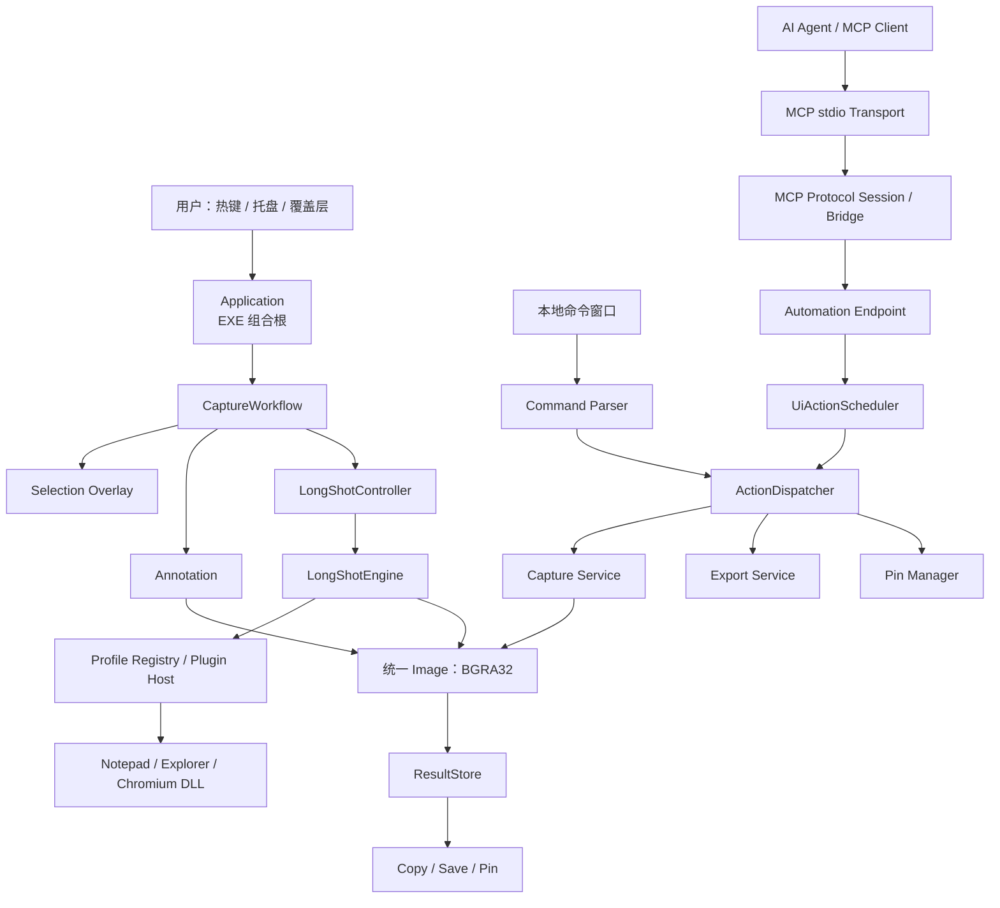
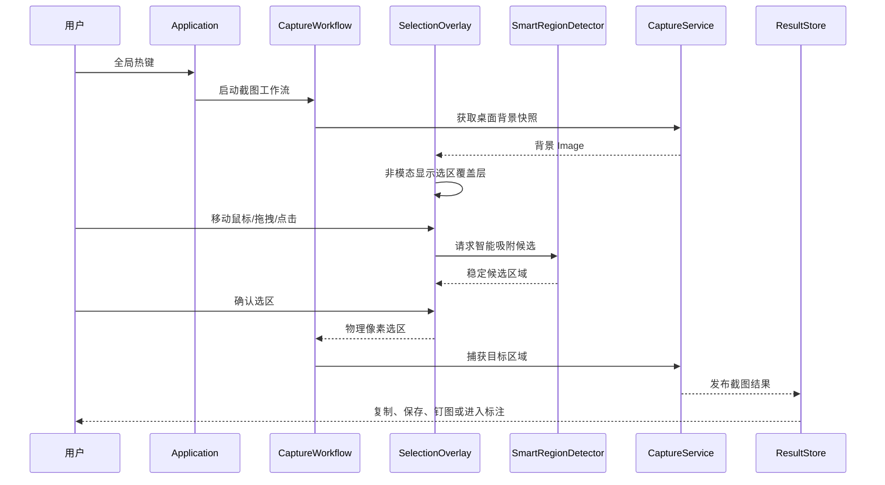
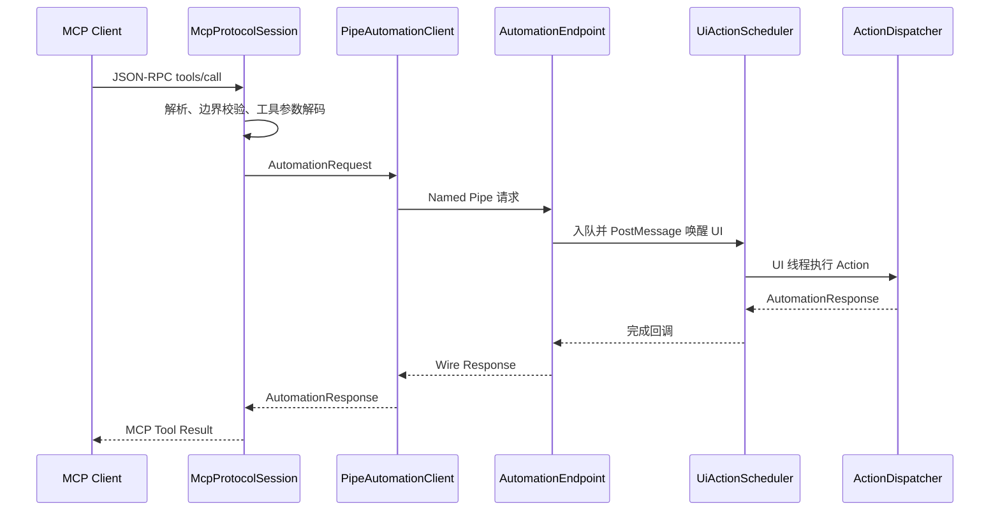
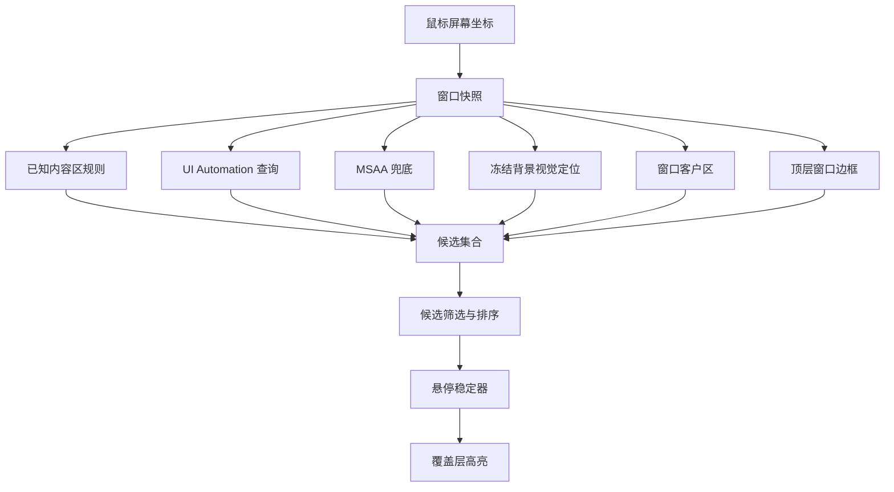
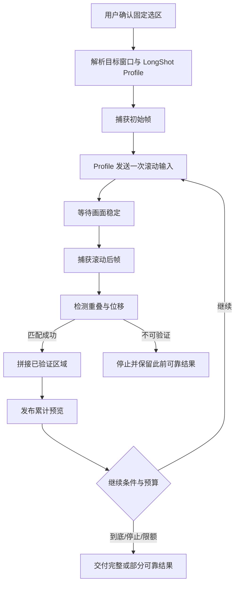
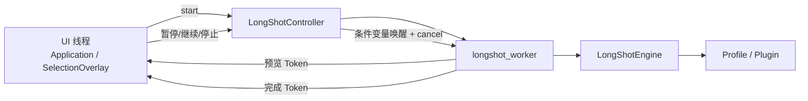
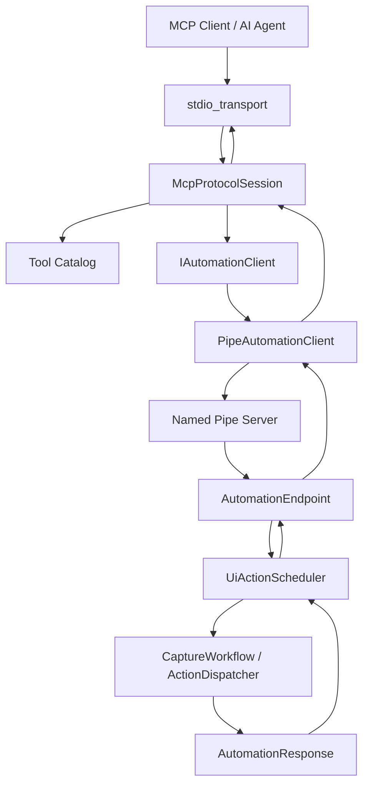
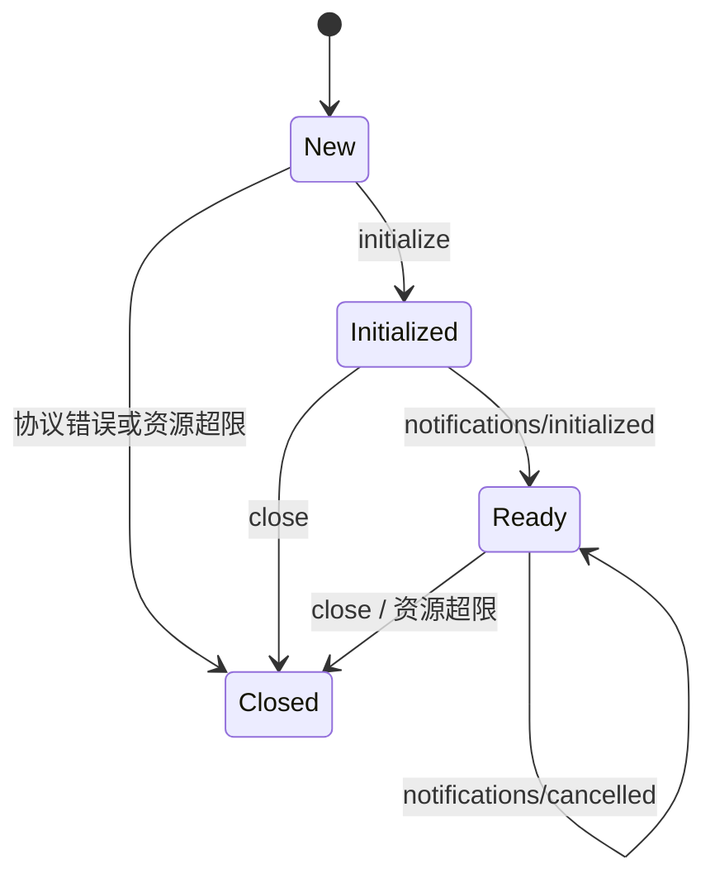
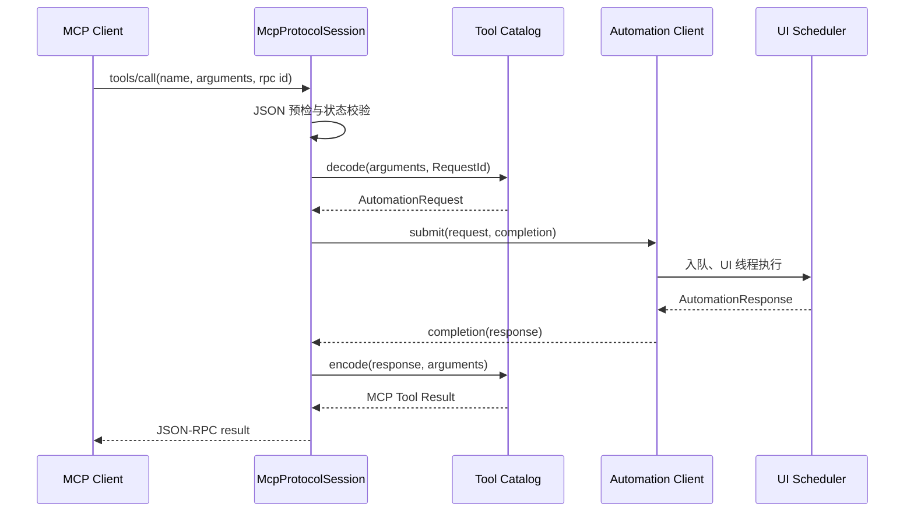
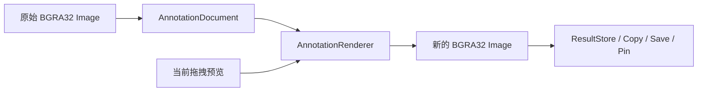

# 轻映 QingYing 项目介绍

## 项目概述

轻映（QingYing）是一款面向 Windows 桌面端的原生轻量化截图工具，采用 C++17 与 Win32 技术栈实现。项目覆盖普通区域截图、窗口/内容区智能吸附、长截图、图片标注、钉图、复制与 PNG 导出，并通过本地命令和 MCP（Model Context Protocol）向 AI Agent 提供受控的本地截图能力。

项目的核心目标不是堆叠功能，而是在桌面端截图高频交互中平衡四类约束：

- 低启动成本与低常驻资源：避免引入 Qt、Electron、浏览器运行时或模型依赖。
- 截图操作的交互即时性：热键触发后快速进入覆盖层，减少鼠标移动过程中的卡顿和高亮抖动。
- 复杂能力的可控扩展：长截图通过受控插件 ABI 适配不同应用，自动化能力通过 Action 合约统一接入。
- 桌面端安全性与稳定性：对跨线程、窗口句柄、Named Pipe、JSON-RPC 输入和长任务生命周期设置明确边界及资源上限。

当前产品形态为“一个主 EXE + 分层静态库 + 受控长截图 Profile DLL”。主进程负责托盘、全局热键、消息循环和依赖组装；底层功能按照截图、选区、标注、长截图、导出、自动化和 MCP 分层，避免外部接口直接依赖 GDI、窗口实现细节或 GUI 私有对象。

---

# 1. 项目框架设计

## 1.1 总体架构与分层

项目采用“组合根 + 稳定业务合约 + 专项能力模块”的分层架构。`Application` 是唯一的进程级组合根，负责建立依赖关系和转发 Win32 消息；各业务模块不反向依赖应用层。

架构中主要模块职责如下：

| 层级/模块 | 核心职责 | 设计原因 |
|---|---|---|
| `Application` | 单实例、托盘、热键、顶层消息循环、依赖组装、退出协调 | 将进程级 Win32 生命周期集中，避免业务模块持有全局状态。 |
| `CaptureWorkflow` | 编排选区、标注、结果动作和交互式长截图 | GUI 属于多阶段状态机，不强行塞入单步命令分发模型。 |
| `ActionDispatcher` | 统一执行可复用的单步业务动作 | 本地命令、IPC、MCP 复用同一动作入口，避免形成第二套截图引擎。 |
| `Capture / Export / Pin` | 区域捕获、剪贴板/PNG 导出、钉图展示与管理 | 将平台资源和结果消费职责隔离，便于独立测试与替换实现。 |
| `Overlay / Window / SmartRegion` | 桌面快照、选区、调节柄、窗口检测、智能吸附 | 将高频鼠标交互与复杂窗口/无障碍查询解耦。 |
| `Annotate` | 标注文档、编辑会话、交互控制和栅格化渲染 | 标注不直接写剪贴板或文件，保持编辑与结果动作解耦。 |
| `LongShot` | 长截图引擎、拼接、Profile 注册与插件宿主 | 将通用拼接与应用特定滚动逻辑分开，扩展不污染主业务链。 |
| `Automation / IPC / MCP` | 自动化合约、UI 调度、Named Pipe、MCP 会话和 stdio 传输 | 外部调用只面向稳定契约，不能跨层直达 UI 或图像捕获实现。 |

## 1.2 关键协作流程

### 1.2.1 图形界面截图流程

该流程以覆盖层为交互边界。选区阶段使用冻结的桌面背景，避免覆盖层自身进入截图；确认后才提交物理像素坐标给捕获模块。这样可以统一 DPI、坐标转换和结果图像格式，避免 GUI 层直接操作底层 GDI 资源。

### 1.2.2 外部自动化流程

外部调用不允许直接调用 `CaptureEngine`、`ExportService`、`PinManager` 或 GUI 私有对象。所有请求都先转换为 `AutomationRequest`，在 UI 线程由调度器统一执行。这一设计解决了自动化进程跨线程访问窗口资源、重入 UI 逻辑和外部调用绕过权限/容量限制的问题。

## 1.3 轻量化设计思路

### 1.3.1 原生技术选型

项目选择 C++17 + Win32 + GDI/GDI+ + WIC，而非跨平台 GUI 框架或嵌入式 Web UI。其原因包括：

- 截图、窗口枚举、DPI 感知、全局热键、托盘、剪贴板和透明覆盖层均是 Windows 原生能力，直接调用可以减少中间抽象与运行时体积。
- 使用 GDI `BitBlt` 完成当前区域捕获路径，避免 DXGI、D3D 设备常驻以及图形驱动兼容性成本；DXGI 仅保留后续扩展位置。
- 图像内部统一为行优先、物理像素坐标的 `BGRA32 Image`，减少模块间格式转换、色彩通道错序和 DPI 语义不一致。
- JSON 仅使用固定版本的 `nlohmann/json`，MCP 传输采用 stdio，自动化进程通信采用 Windows Named Pipe，不引入 HTTP 服务、端口监听或网络依赖。

### 1.3.2 功能裁剪策略

轻映并不试图做通用桌面自动化平台或任意应用的长截图工具，而是主动限定产品边界：

- 长截图仅支持受控 Profile，不对未知应用承诺滚动可控性。
- Profile 通过稳定 C ABI 装载为 DLL，主程序只维护通用流程、捕获和拼接；应用差异封装在 Notepad、Explorer、Chromium 等 Profile 中。
- MCP 只暴露受控工具目录和结构化结果，不开放任意 Win32 消息、任意窗口句柄操作或脚本执行能力。
- 标注采用本地栅格化模型，不引入复杂矢量文档格式、云同步或协同编辑。
- GUI 多步骤交互保留在 `CaptureWorkflow`，不会为了“统一接口”强制改造成不适合的无状态 Action。

这种裁剪使项目把资源投入在桌面截图真实难点：窗口边界、滚动稳定性、图像拼接、UI 生命周期和 AI 本地调用安全性，而不是承担泛化平台的长期兼容成本。

## 1.4 内存与运行开销控制

### 1.4.1 热路径避免动态分配

智能吸附的鼠标悬停路径使用固定容量候选集合：

- 最大候选数量为 `SmartRegionMaxCandidates = 9`。
- 为已知内容区、视觉候选、客户区和窗口边界预留回退槽位。
- 无障碍候选数量有限制，避免 UIA/MSAA 返回大量节点导致频繁分配。
- 窗口快照缓存只在适用策略下复用，减少每次鼠标移动重复调用窗口检测。

该策略针对截图覆盖层中的高频 `WM_MOUSEMOVE`。悬停过程中最重要的是稳定帧时间，而不是无限扩展候选数量。

### 1.4.2 图像与长截图预算

长截图通过 `LongShotLimits` 对任务进行硬约束：

- 最大输出高度，避免拼接图无限增长。
- 最大工作内存，默认上限为 512 MiB。
- 最大持续时间，默认 3 分钟，合法范围不超过 30 分钟。
- 最大重采次数和滚动稳定轮询次数，限制动态页面或失效窗口导致的空转。
- 固定顶部/底部区域可显式排除，不将固定浏览器工具栏等内容反复拼入结果。

长截图结果以 `LongShotOutcome` 表达，区分“完成状态”和“图像质量”。即使任务异常终止，也只保留经过验证的累计图像；取消、未启动和请求拒绝不会交付内部残留图像。该设计避免将未验证像素作为成功截图向用户或 MCP 客户端输出。

### 1.4.3 有界队列与消息合并

自动化与 MCP 路径均采用有界控制：

- `UiActionScheduler` 的容量同时覆盖排队请求和运行中请求，并为每个已接纳请求预留完成槽。
- UI 唤醒消息支持合并，一个待处理 wake 可以覆盖一批请求或完成事件，减少 `PostMessage` 压力。
- MCP 会话限制单帧大小、JSON 嵌套深度、输出帧数、单连接输出字节数和在途控制请求数。
- 输出队列超限时会关闭该会话的准入，而不是持续累计内存。

## 1.5 资源与故障边界

项目将故障处理放在跨模块边界，而不是依赖异常穿透 UI 消息循环：

- 长截图工作线程通过故障边界封装，捕获失败会写入稳定的失败阶段和错误码。
- 自动化请求、Handler、Pipe、Scheduler 等失败来源可保留诊断信息。
- 图形、窗口和线程资源优先通过 RAII 管理；`Application` 统一协调退出，避免 GUI 资源先销毁而后台任务仍持有引用。
- 外部自动化接口只接受经过身份和协议校验的请求上下文，避免将客户端传入的窗口/结果标识直接视为可信资源。

---

# 2. 智能吸附模块

## 2.1 模块定位

智能吸附用于在截图覆盖层中，根据鼠标所在位置自动识别更有意义的截图边界。它解决传统矩形框选的两个问题：

- 用户需要手工精确贴合窗口、客户区或内容区域，操作成本高。
- 复杂桌面应用中，单纯按顶层窗口边界截图会包含标题栏、侧边栏、滚动条或无关控件。

模块输出统一的 `SmartRegionCandidate`，包含区域矩形、所属窗口、来源、语义、无障碍元数据和视觉置信度。所有矩形使用物理屏幕坐标，右侧与底部采用开区间语义，便于和截图坐标系统保持一致。

## 2.2 候选来源与降级链路

候选来源采用由精确到兜底的多层策略：

1. 已知内容区规则：针对浏览器外壳、特定应用结构等可识别场景，优先输出明确的内容区域。
2. UI Automation：获取控件树、可操作模式、名称、焦点和控件类型等信息，用于识别独立控件或内容面板。
3. MSAA：作为 UIA 不可用时的兼容性回退。
4. 视觉定位：基于截图背景的边缘、连通区域和区域置信度，补充无障碍树不完整的场景。
5. 客户区与窗口边界：始终保留的最后回退，保证功能不会因智能识别失败而不可用。

## 2.3 边界判定算法

候选选择不以“面积最小”为唯一规则，而是综合可操作性、来源可靠性和区域语义：

- 首先要求候选矩形合法且包含当前鼠标点。
- 优先选择可独立操作的局部候选，避免将泛化容器误判为可截图对象。
- UIA 候选按质量分层，例如命名可操作控件、支持操作模式的控件、内容表面、泛化容器。
- 视觉候选必须达到最小置信度；默认阈值为 70，低置信度不应压过窗口或客户区回退。
- 相邻层级候选可在用户操作时循环切换，满足控件、内容区、客户区和窗口边框之间的选择需求。
- 对浏览器顶部控件区，保留特定策略，避免视觉内容候选错误覆盖浏览器壳层。

候选集合使用固定容量数组，并始终为基础回退候选保留位置。这样既保证智能识别失败时仍有可选区域，也防止复杂无障碍树在鼠标移动期间扩大内存与计算成本。

## 2.4 交互触发与稳定性控制

智能吸附由覆盖层鼠标移动触发，但不会对每条鼠标消息都执行完整的跨进程查询：

- `SmartRegionUpdateGate` 设置最小处理间隔为 16 ms，对高频移动做节流。
- 首次移动允许立即检测，保证用户初次悬停时的响应速度。
- `SmartRegionHoverStabilizer` 对候选切换设置 48 ms 延迟，避免指针跨越父子控件、重叠窗口时高亮框闪烁。
- `SmartRegionAsyncPresentationGate` 会识别短时间快速移动；在 Chromium 顶部控件区可延后异步结果展示，减少 UIA 结果滞后造成的视觉跳动。
- `SmartRegionHoverRenderGate` 仅在用户可见的悬停状态或区域发生变化时请求重绘。

确认点击时，系统优先采用已检测完成的最新局部候选；泛化回退候选不会轻易覆盖稳定的局部候选。这使“显示稳定性”和“点击准确性”可以分别优化：显示侧避免抖动，提交侧尽量采用最新有效证据。

---

# 3. 长截图架构细节

## 3.1 整体流程

长截图采用“固定选区 + 受控滚动 + 双帧验证 + 重叠拼接”的架构。它不依赖滚动条位置猜测，而是通过滚动前后的真实图像帧判断内容推进与重叠区域。

关键设计原则是：每一轮只对当前帧对建立证据，不依据历史接缝猜测新帧位置。这样可以防止动态内容、平滑滚动、光标闪烁或固定栏导致的历史错误累积。

## 3.2 Profile 与插件模型

长截图引擎分为通用层和应用适配层：

- `LongShotEngine` 负责安全限制、捕获循环、画面稳定等待、重叠检测、拼接和诊断。
- `LongShotProfileRegistry` 根据目标窗口选择 Profile。
- `LongShotPluginHost` 以受控 ABI 加载长截图 Profile DLL。
- 内置 Profile 覆盖记事本、资源管理器和 Chromium 浏览器类应用。
- 通用滚轮 Profile 作为有限能力兜底，不承诺对所有应用成功。

插件仅处理“如何定位可滚动目标、如何发送滚动输入、如何判定目标仍有效”等应用差异；图片捕获、拼接、内存预算和结果交付始终由主程序控制。这样既提升特定应用的成功率，又避免将第三方 DLL 扩展为拥有主程序资源的任意插件系统。

## 3.3 线程模型

`LongShotEngine` 是同步捕获服务，`LongShotController` 在其上构建异步交互生命周期：

具体分工如下：

- UI 线程负责显示选区覆盖层、处理暂停/停止按钮、消费预览和完成消息。
- 工作线程执行 `LongShotEngine::captureSelection`，避免滚动、画面稳定轮询、捕获和拼接阻塞桌面交互。
- 预览图像通过带会话标识的消息投递回 UI；会话不匹配、已取消或正在退出时，预览会被丢弃。
- 完成结果使用 `UiMessageToken` 交付，UI 线程验证 token 和 session 后再 join 工作线程并移动结果。
- Overlay 回调只更新控制状态，不在回调中执行 `join()`，避免窗口消息处理期间发生死锁或 UI 卡死。

## 3.4 任务启停与暂停控制

启动新长截图前，控制器首先取消旧任务，并使用有限时间等待旧线程完成：

- 重启交接等待预算为 250 ms。
- 若旧 Profile 未响应取消请求，新的任务会被拒绝，而不是无限阻塞 UI 线程或重叠运行两个滚动任务。
- 新会话生成递增的 request/session 标识，确保旧任务的预览或完成消息不能污染当前界面。
- 暂停状态由原子变量保存，工作线程在继续回调中通过条件变量等待。
- 停止、取消或恢复会唤醒条件变量，同时调用 `LongShotEngine::notifyControlChange()`，让画面稳定等待尽快重新检查控制状态。
- `LongShotEngine::cancel()` 是协作式取消；旧 Profile 即使未及时响应，也不会被强制终止。

该模型避免使用 `TerminateThread` 等不安全的强制终止机制。对于截图插件这种可能持有窗口、GDI 或调用栈资源的任务，安全地保留生命周期比快速释放更重要。

## 3.5 超时与安全保护机制

长截图的停止条件分为业务结束和安全终止两类：

| 类别 | 典型条件 | 行为 |
|---|---|---|
| 正常完成 | 已到达底部 | 交付已验证拼接结果，标识为完整。 |
| 用户控制 | 停止、取消 | 停止保留已验证结果；取消不交付结果。 |
| 内容无进展 | 整帧重叠、滚动位置稳定 | 防止无限滚动和重复拼接。 |
| 匹配失败 | 当前帧无法证明与上一可靠帧的接缝 | 停止，保留此前可靠输出，不猜测接缝。 |
| 安全限额 | 时长、输出高度、工作内存、重采次数、稳定轮询次数超限 | 结束任务并记录对应预算原因。 |
| 环境异常 | 目标窗口失效、输入不可用、捕获或拼接失败 | 记录失败阶段和错误码。 |

结果对象记录接受帧数、滚动输入次数、重采次数、峰值工作内存、耗时、停止原因和失败阶段。该诊断信息既可用于桌面端问题定位，也可通过自动化/MCP 路径向上层提供可解释状态。

## 3.6 资源回收与限时 join

退出过程由 `ApplicationShutdownCoordinator` 协调，采用共享总预算，默认总退出预算为 5 秒。长截图控制器的退出拆分为三步：

1. `beginShutdown()`：拒绝新任务，设置关闭状态并请求取消。
2. `joinUntil(deadline)`：在共享截止时间前等待工作线程完成；内部通过 `worker_done_condition.wait_until` 等待，而不是忙轮询。
3. `finishShutdown()`：只有线程已完成 join 后，才清理未消费的完成消息、释放窗口借用关系和 UI 上下文。

该策略的关键点包括：

- `joinUntil` 检查是否为当前工作线程，避免自 join。
- 线程超时不会被 detach 或强制杀死；系统记录诊断并保留其依赖对象，避免悬空引用。
- 消息队列在 worker join 后再 drain，防止后台线程继续投递到已销毁的覆盖层或主窗口。
- 完成消息使用 token 和 session 进行校验，过期消息、重复消息和关闭期间消息均不会驱动结果交付。
- 控制器析构和显式 shutdown 均具备幂等语义。

---

# 4. MCP 模块实现

## 4.1 模块定位

MCP 模块将轻映的本地截图能力封装为 AI Agent 可调用的标准工具，而不是让 AI 直接操作桌面窗口、图形 API 或进程内对象。

模块的目标是提供：

- 基于 JSON-RPC 2.0 的 MCP 会话管理。
- 基于 stdio 的进程级接入方式。
- 基于 Named Pipe 的主进程自动化通道。
- 基于 Action Catalog 的工具发现、参数校验和结果编码。
- 可取消、有容量上限、可关联操作句柄的异步任务模型。

其本质是一个“协议适配层”，不是第二套业务实现。MCP 发起的截图、保存、复制、钉图等动作最终复用已有 Action 与业务 Handler。

## 4.2 模块分层

各层职责如下：

| 模块 | 职责 |
|---|---|
| `stdio_transport` | 读取和写入逐行 JSON-RPC 消息，负责连接生命周期，不在回调中直接执行业务。 |
| `McpProtocolSession` | 协议状态机、JSON 预检、初始化协商、工具调用、取消通知、输出队列管理。 |
| `Tool Catalog` | 将 Action 工具注册为 MCP `tools/list` 描述，提供输入 JSON Schema、参数解码和结果编码。 |
| `IAutomationClient` | MCP 对自动化执行端的抽象，不依赖 GUI 或 `ActionDispatcher`。 |
| `PipeAutomationClient/Server` | 通过 Windows Named Pipe 在 MCP 宿主和截图主进程之间传递受控请求。 |
| `AutomationEndpoint` | 验证连接上下文，接入调度器，控制请求、响应和断线语义。 |
| `UiActionScheduler` | 将业务动作切换到 UI 线程执行，并在受控队列中完成异步结果交付。 |

## 4.3 接口与工具模型

MCP 会话完成 `initialize` 和 `notifications/initialized` 后进入 Ready 状态，之后才允许调用：

- `tools/list`：返回固定工具目录及其 JSON Schema。
- `tools/call`：按工具名解析参数，生成 `AutomationRequest`。
- `ping`：用于会话存活检查。
- `notifications/cancelled`：取消对应的在途工具请求。

工具目录来源于 Action Catalog。MCP 层只处理工具名称、参数和结果格式，不直接硬编码具体截图逻辑。典型工具能力包括窗口截图、中心裁剪、保存、复制、钉图、状态查询和操作查询等。

每次 `tools/call` 都被映射为内部唯一 `RequestId`。MCP 的 JSON-RPC id 与内部请求 id 分离：

- JSON-RPC id 用于保证协议层“一次请求至多一次响应”。
- `RequestId` 用于自动化调度、取消控制和诊断关联。
- `operation_id` 用于表示可查询或可追踪的业务操作。
- `result_id` 用于表示结果存储中的受控图像对象，而不是原始内存地址或任意文件路径。

这种句柄化设计避免外部客户端持有 Win32 句柄、裸指针或未授权文件路径。

## 4.4 协议状态与消息模型

一次工具调用的数据流如下：

结果采用 MCP 标准内容块与结构化内容双轨输出：

- `content`：以 `text` 形式提供序列化结果，便于通用客户端展示。
- `structuredContent`：保留结构化 JSON，便于 Agent 继续执行判断与链式调用。
- `isError`：明确区分工具级业务错误和协议解析错误。
- 对状态工具，在截图主进程不可达时返回结构化的可达性信息，而不是把“主进程未运行”混同为协议崩溃。

## 4.5 输入校验与协议安全

MCP 模块对输入采用“先预检、后解析、再解码”的三层控制：

1. 行级限制：输入帧长度不能超过 `AutomationLimits`。
2. JSON SAX 预检：限制最大嵌套深度，拒绝二进制字段、重复 key、过长字符串和非法 NUL 字符。
3. 语义校验：校验 `jsonrpc = "2.0"`、请求 id、方法名、参数对象、工具名及工具 Schema。

其他保护机制包括：

- `initialize` 只能在 New 阶段调用一次。
- `tools/list` 和 `tools/call` 仅在 Ready 阶段开放。
- 同一活跃 JSON-RPC id 不允许重复提交；发生歧义时关闭会话，避免一个请求返回两次。
- 在途工具调用与取消控制请求均受数量限制。
- 每个连接的输出帧数与输出总字节数受限，超限后清空队列并停止会话。
- 取消通知会抑制原请求的最终响应，即使底层取消执行失败，也不会向客户端产生“取消后又成功返回”的语义冲突。

## 4.6 与 UI 和其他模块的通信方式

MCP 不直接进入 UI。跨进程通信经过 Named Pipe，跨线程回到 UI 时经过 `UiActionScheduler`：

- Pipe 层负责帧编解码、身份与连接上下文。
- Scheduler 的 `submit` 可以由非 UI 线程调用，但实际业务执行只在 UI 线程发生。
- Scheduler 使用 `PostMessage` 投递 `WM_QINGYING_AUTOMATION_WAKE`，不允许同步内联执行，避免协议线程重入 GUI。
- 一个待处理 wake 可以覆盖有界批量任务；若投递失败，可通过受控 drain 回收已预留的完成槽。
- 完成回调在锁外执行，避免用户回调、协议编码或业务逻辑在调度器锁内重入。
- 应用关闭时先停止接收，再等待生产者结束，最后执行回调和消息清理。

该通信模型保证 AI 调用和用户交互共享同一个业务执行面，同时避免 MCP 客户端的输入节奏直接影响桌面 UI 的线程安全。

---

# 5. 标注模块实现

## 5.1 标注数据结构

标注模块采用“文档对象 + 样式 + 几何数据”的轻量模型。

`Annotation` 支持以下类型：

- 矩形、椭圆。
- 箭头。
- 自由画笔。
- 文字。
- 马赛克。

每条标注包含：

- `AnnotationType`：标注类型。
- `AnnotationStyle`：BGRA 颜色、透明度、描边宽度、字体、字号、粗体、斜体、填充、线型和箭头样式。
- `RectF`、起止点或点集：根据工具类型描述几何信息。
- 文本内容、文本换行宽度和旋转角度。
- 马赛克块尺寸。

`AnnotationDocument` 管理已提交标注和 redo 栈。写入时执行最小合法性校验，例如矩形/椭圆必须达到最小尺寸、画笔和马赛克必须有至少两个点、文本不能为空。这样可以避免无效对象进入渲染和撤销链。

## 5.2 渲染管线

渲染器遵循“原图只读、结果新建”的原则：

- `AnnotationRenderer::rasterize` 将原始图像与已提交文档栅格化为新的 `Image`。
- 拖拽过程中的 preview 不必先写入文档，可以叠加在已提交标注之上。
- 几何图形、马赛克和像素合成不依赖公开 Win32 句柄。
- 文字通过内部 GDI 栅格化后写回 BGRA32 图像；公共接口不暴露 `HDC` 等平台资源。

这种设计将编辑状态与最终像素结果分离，便于撤销、预览和导出复用同一渲染入口。

## 5.3 事件响应与图层管理

`AnnotationInteractionController` 管理鼠标绘制状态：

1. 鼠标按下：校验工具和画布边界，创建预览对象。
2. 鼠标移动：更新矩形边界、箭头终点或自由笔迹点集。
3. 鼠标松开：通过 `AnnotationEngine` 将合法预览提交到文档。
4. 撤销：绘制中的预览优先取消，再执行文档撤销。
5. 重做：从 redo 栈恢复最近撤销对象。
6. 取消：仅清理当前预览，不影响已提交文档。

图层顺序由 `AnnotationDocument::items()` 的插入顺序决定，后添加标注覆盖先添加标注。当前模型不引入独立图层树、混合组或复杂选择器，原因是截图标注的典型场景是一次性轻编辑：优先保证交互直观、内存可控和导出一致性。

标注编辑器 `AnnotationOverlay` 采用非模态窗口语义：显示后立即返回，确认或取消时通过回调交付结果。编辑器只负责窗口、输入和渲染，不直接复制、保存或钉图；这些结果动作仍由工作流和 Action 层执行。

---

# 核心技术难点总结

## 1. 轻量化与能力完整性的平衡

桌面截图工具既要求热键响应快、常驻成本低，又需要覆盖层、标注、长截图、导出和自动化能力。项目通过原生 Win32、统一 BGRA32 图像、静态库分层、受控 DLL Profile 和有界队列，在不引入重型运行时的条件下保留核心功能扩展空间。

## 2. 智能吸附的准确性与稳定性

窗口边界、客户区、无障碍控件和视觉内容区可能相互重叠。项目以多来源候选、质量分层、置信度阈值、固定容量集合、16 ms 节流和 48 ms 稳定延迟共同解决“识别得到”与“交互可用”之间的矛盾。

## 3. 长截图的可验证拼接

长截图最难的部分不是发送滚轮，而是证明当前帧与上一帧可以可靠拼接。项目通过双帧捕获、重叠检测、重采控制、稳定轮询、固定边缘排除和安全预算，避免以历史接缝或滚动次数进行猜测，并在失败时保留已验证结果。

## 4. 长任务的线程生命周期

长截图涉及 UI、后台工作线程、插件回调、预览消息和退出过程。项目采用协作式取消、条件变量暂停、会话 token、限时 `joinUntil`、共享退出截止时间和延迟资源回收，避免强制终止线程带来的窗口资源泄漏、悬空引用和 UI 死锁。

## 5. MCP 接入的安全边界

AI Agent 需要调用本地截图能力，但不能直接控制桌面底层资源。项目通过 MCP JSON-RPC 状态机、严格输入边界、有界输出队列、Named Pipe、Automation 合约和 UI 线程调度，将“AI 工具调用”转换为“受控业务动作”，在可用性、可观测性与桌面端安全性之间建立清晰边界。
